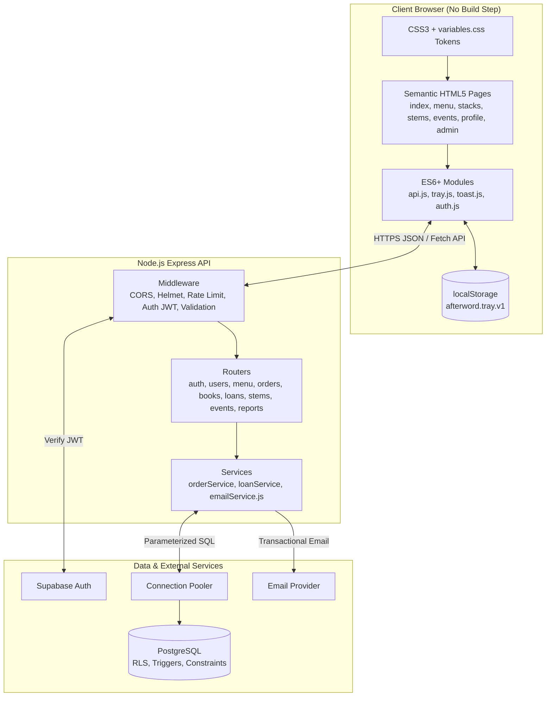
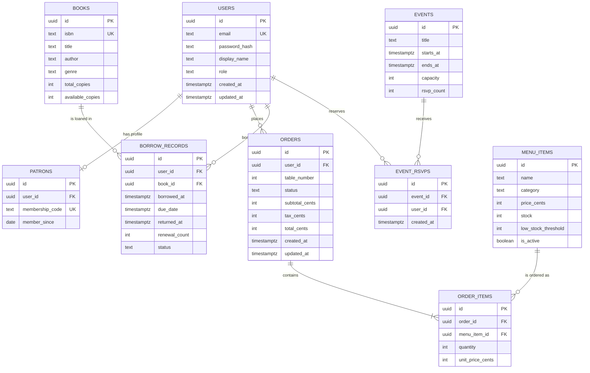
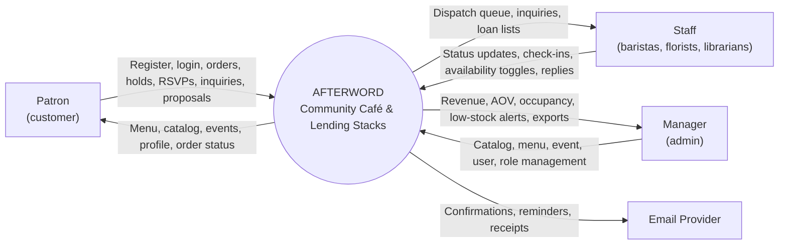
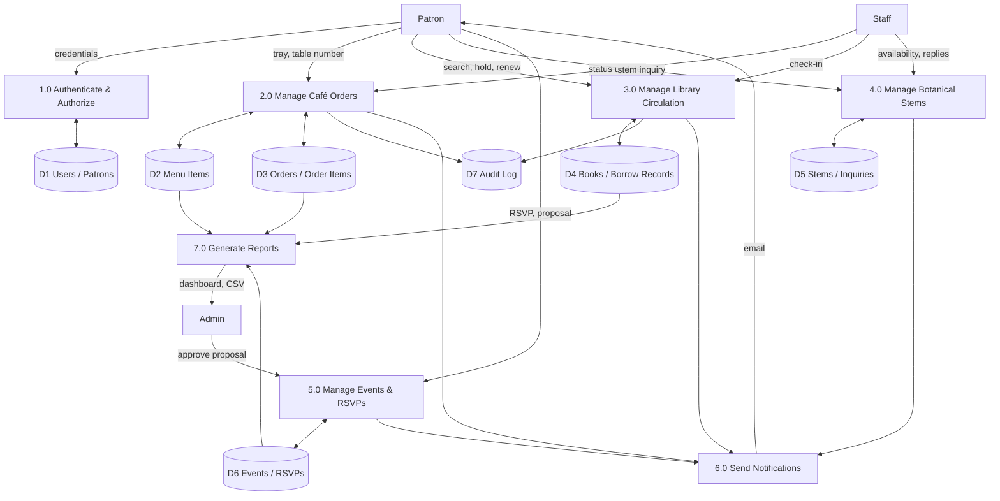

# AFTERWORD — Community Café & Lending Stacks

## Software Requirements Specification (SRS)

| Field | Value |
| --- | --- |
| Document Version | 1.0 |
| Status | Release Candidate |
| Date | September 30, 2026 |
| Authors | Lead Software Architect; Technical Writer |
| Audience | Engineering, QA, Operations, Business Stakeholders |

---

## 1. Executive Summary & Project Overview

### 1.1 Project Title

**AFTERWORD — Community Café & Lending Stacks**

### 1.2 Problem Statement

Community "third spaces" today are split across three traditional retail and hospitality silos. AFTERWORD addresses each one.

#### 1.2.1 Fragmented Customer Experience

- **Cafés** rarely offer quiet, curated reading areas. Patrons who want to read or work must choose between a noisy counter and a silent library.
- **Municipal libraries** lack warm, social beverage spaces, so visitors cannot linger over a coffee with a borrowed volume.
- **Florists** operate as isolated counters with no connection to the café or reading experience, so a stem purchase is never part of a single visit.
- **Event spaces** rely on disjointed third-party forms and ticketing tools, leaving RSVPs disconnected from the patron's identity, loans, and orders.

#### 1.2.2 Manual Operational Inefficiencies

- **Paper order tickets** cause order misplacement, duplicated drinks, and missed tables.
- **Manual stock counts** lead to item overselling when a pastry, bean, or stem sells out between counts.
- **Unmonitored library loans** result in lost volumes, unknown due dates, and no reliable count of available copies.
- **RSVP tracking on paper clips** leads to overbooked workshops and no live capacity visibility.

#### 1.2.3 Lack of Real-Time Coordination

Service staff struggle to synchronize table deliveries, inventory deductions, and circulation holds. Without a central digital Point-of-Sale (POS) and administration console, each activity is tracked in a separate place. Managers cannot see revenue, seating occupancy, or low-stock conditions until the day is over.

### 1.3 Proposed Solution

AFTERWORD is a unified "third space" web application. It combines four physical offerings behind one patron identity, one order pipeline, and one staff/admin console:

1. **Specialty Espresso Bar** — In-seat table ordering for Tables #1–16. Patrons build a persistent order tray, pay 8% tax on the subtotal, and the order is dispatched to the barista console with the table number.
2. **Lending Library** — A searchable stacks catalog with 21-day loan holds, live available-copy counters, 14-day renewals, and staff check-in on return.
3. **Botanical Stem Bar** — Daily fresh stems with availability toggles, plus custom stem-selection inquiries handled by florists.
4. **Community Gathering Space** — An interactive event calendar with workshop capacity progress bars, 1-click RSVP toggles, and community-submitted event proposals.

Every module writes to the same relational database. Inventory deductions, loan counters, and RSVP capacity are enforced by database constraints and triggers, so the system stays consistent even under concurrent use.

### 1.4 Target Audience

| # | Role | Who They Are | Primary Needs | System Role Value |
| --- | --- | --- | --- | --- |
| 1 | **Public Users / Patrons** | Remote workers seeking a quiet, caffeinated workspace; bibliophiles who borrow and donate volumes; event attendees joining workshops | Order from their seat, browse and hold books, see loan due dates, RSVP in one click, buy or inquire about stems | `customer` |
| 2 | **Service Staff / Baristas / Florists** | Frontline employees on shared tablets or counter terminals | Real-time dispatch console with table numbers, status advancement, check volumes in and out, toggle stem availability, review inquiries | `staff` |
| 3 | **Managers / Admins** | Business owners and shift managers | Live sales, Average Order Value, seating occupancy %, low-stock alerts, catalog and menu management, event and user administration | `admin` |

---

## 2. Requirements Specification

### 2.1 Functional Modules

Requirement identifiers use the format `FR-<module>-<nn>`. "Shall" denotes a mandatory requirement.

#### 2.1.1 Authentication & Authorization (AUTH)

| ID | Requirement |
| --- | --- |
| FR-AUTH-01 | The system shall support account registration with email, display name, and password (minimum 8 characters, at least one letter and one digit). |
| FR-AUTH-02 | Passwords shall be hashed with **bcrypt** (cost factor ≥ 12) before storage. Plaintext passwords shall never be persisted or logged. |
| FR-AUTH-03 | Authentication shall be provided by **Supabase Auth** (JWT access tokens) with an **Express session** fallback for the API's server-side session cookie (`httpOnly`, `secure`, `sameSite=lax`). |
| FR-AUTH-04 | Access tokens shall expire after 60 minutes; refresh tokens shall be rotated on use. |
| FR-AUTH-05 | **Role-Based Access Control (RBAC)** shall define three roles: `customer` (default), `staff`, and `admin`. |
| FR-AUTH-06 | Authorization middleware shall verify the token, load the role, and reject unauthorized requests with `401` (unauthenticated) or `403` (insufficient role). |
| FR-AUTH-07 | Only an `admin` shall be able to promote or demote a user's role. |
| FR-AUTH-08 | Failed logins shall be rate-limited to 5 attempts per 15 minutes per IP and email. |

**Role Permission Matrix**

| Capability | Guest | customer | staff | admin |
| --- | --- | --- | --- | --- |
| Browse menu, catalog, stems, events | ✔ | ✔ | ✔ | ✔ |
| Place café order | ✖ | ✔ | ✔ | ✔ |
| Hold / renew a book | ✖ | ✔ | ✔ | ✔ |
| RSVP to event; submit proposal | ✖ | ✔ | ✔ | ✔ |
| Submit stem inquiry | ✖ | ✔ | ✔ | ✔ |
| View own profile, loans, orders | ✖ | ✔ | ✔ | ✔ |
| View dispatch queue; advance order status | ✖ | ✖ | ✔ | ✔ |
| Check books in/out; toggle stem availability | ✖ | ✖ | ✔ | ✔ |
| Manage menu, books, events, users; view reports | ✖ | ✖ | ✖ | ✔ |

#### 2.1.2 User Management (USR)

| ID | Requirement |
| --- | --- |
| FR-USR-01 | On registration, the system shall create a `users` row and a linked `patrons` row. |
| FR-USR-02 | Each patron shall receive a unique **Patron Membership Code** in the format `#MEM-XXX`, where `XXX` is a zero-padded sequence number from a PostgreSQL sequence (`#MEM-001`, `#MEM-002`, … `#MEM-999`, then `#MEM-1000` and beyond without truncation). Generation shall be atomic and collision-free. |
| FR-USR-03 | The **Patron Profile dashboard** (`profile.html`) shall display: display name, membership code, member-since date, active loans, due dates (with overdue highlighting), renewal eligibility, and order history. |
| FR-USR-04 | A patron shall be able to update display name and password. Email changes shall require re-verification. |
| FR-USR-05 | Order history shall list each order's number, date, table, items, total, and current status. |
| FR-USR-06 | Active loans shall show book title, author, borrowed date, due date, days remaining, and renewal count. |
| FR-USR-07 | Admins shall be able to search users by name, email, or membership code and change roles. |

#### 2.1.3 Audit Logging & State Tracking (AUD)

| ID | Requirement |
| --- | --- |
| FR-AUD-01 | Every persistent business record (orders, borrow records, RSVPs, inquiries, proposals) shall carry `created_at` and `updated_at` timestamps in UTC (`timestamptz`). `updated_at` shall be maintained by a database trigger. |
| FR-AUD-02 | Orders shall follow a strict status pipeline: **`Pending` → `Preparing` → `Ready` → `Completed`**. A `Cancelled` terminal state shall be available from `Pending` or `Preparing` only. |
| FR-AUD-03 | Status transitions shall be validated server-side. Skipping states or moving backward shall return `409 Conflict`. |
| FR-AUD-04 | Each order status transition shall be written to an append-only `audit_log` table containing actor ID, entity type, entity ID, previous state, new state, and timestamp. |
| FR-AUD-05 | Loan state transitions (`Active` → `Returned` or `Overdue`) and role changes shall also be written to `audit_log`. |
| FR-AUD-06 | `audit_log` rows shall be immutable; `UPDATE` and `DELETE` shall be denied to all application roles. |

#### 2.1.4 Domain-Specific Modules

##### A. Café POS & Order Tray (POS)

| ID | Requirement |
| --- | --- |
| FR-POS-01 | Menu items shall be displayed by category (Espresso, Tea, Food, Pastry) with price, description, and stock status (In Stock / Low / Sold Out). |
| FR-POS-02 | The **Order Tray** shall be persisted in `localStorage` under the key `afterword.tray.v1` so it survives page reloads and navigation. |
| FR-POS-03 | The tray shall support add, remove, and quantity modifiers (+ / −, minimum 1, maximum 10 per line). Removing the last unit removes the line. |
| FR-POS-04 | The tray shall compute: `subtotal = Σ(price × qty)`, `tax = round(subtotal × 0.08, 2)`, `total = subtotal + tax`. All money values shall be handled in integer cents server-side to avoid floating-point error. |
| FR-POS-05 | The patron shall select a **Table (#1–#16)** before submitting. Submission shall be blocked without a valid table. |
| FR-POS-06 | On submission, the API shall, in a single atomic transaction: validate stock, insert the order and its items, and deduct stock. If any line lacks stock, the entire transaction shall roll back and the response shall identify the unavailable items. |
| FR-POS-07 | Stock **auto-deduction** shall be performed by a PL/pgSQL `AFTER INSERT` trigger on `order_items`. A cancelled order shall restore stock via a trigger on `orders.status`. |
| FR-POS-08 | Prices used in the order shall be re-read from the database at submission (never trusted from the client). |
| FR-POS-09 | On success, the tray shall be cleared and the patron shall see an order confirmation with order number and table. |

##### B. Library Circulation Module (LIB)

| ID | Requirement |
| --- | --- |
| FR-LIB-01 | The **Stacks catalog** shall support case-insensitive search across title, author, genre, and ISBN, with filters for genre and availability. |
| FR-LIB-02 | Each book shall track `total_copies` and `available_copies`, where `0 ≤ available_copies ≤ total_copies`. |
| FR-LIB-03 | A patron shall place a **21-day loan hold**. The due date is set to `borrowed_at + 21 days`. The available-copy counter shall be decremented by a database trigger on `borrow_records` insert. |
| FR-LIB-04 | A patron shall not hold the same title twice concurrently and shall not exceed 5 active loans. |
| FR-LIB-05 | A patron shall be able to **renew** an active loan once for **14 days**, provided the loan is not overdue. Renewal extends `due_date` by 14 days and increments `renewal_count`. |
| FR-LIB-06 | Staff shall perform a **book return check-in**. The trigger shall increment `available_copies` and set `returned_at`. |
| FR-LIB-07 | A scheduled job (or lazy evaluation on read) shall mark loans past `due_date` as `Overdue`. |
| FR-LIB-08 | Patrons shall be able to **donate volumes** through a donation form; staff review and, when accepted, add the book. A confirmation email shall be sent. |
| FR-LIB-09 | A book with `available_copies = 0` shall show "All copies on loan" and disable the hold button. |

##### C. Botanical Floral Studio Module (BOT)

| ID | Requirement |
| --- | --- |
| FR-BOT-01 | The Stem Bar shall list **daily fresh stems** with name, price per stem, color, and availability. |
| FR-BOT-02 | Staff shall toggle stem availability (`is_available`) in one action; the public listing shall reflect the change within one polling interval (15 s). |
| FR-BOT-03 | Patrons shall submit a **stem-selection inquiry** (selected stems, quantity, occasion, requested pickup date, notes). |
| FR-BOT-04 | Inquiries shall follow the statuses `New` → `In Review` → `Quoted` → `Closed`. Florists shall be able to add a reply note. |
| FR-BOT-05 | Stems added to the café tray as add-ons shall use the same POS stock-deduction pipeline. |

##### D. Community Events Module (EVT)

| ID | Requirement |
| --- | --- |
| FR-EVT-01 | The interactive calendar shall display events by month, with day cells linking to event details. |
| FR-EVT-02 | Each workshop shall show a **capacity progress bar** (`rsvp_count / capacity`) with an accessible text equivalent ("12 of 20 seats taken"). |
| FR-EVT-03 | A patron shall RSVP or cancel via a **1-click toggle**. The API shall reject RSVPs when the event is full (`409`), and shall be idempotent per (user, event). |
| FR-EVT-04 | Capacity enforcement shall be atomic (row lock on the event) so concurrent RSVPs cannot overbook. |
| FR-EVT-05 | Patrons shall submit **community proposals** (title, description, preferred date, expected attendance). Admins shall approve (creating an event) or reject with a note. |
| FR-EVT-06 | Past events shall be read-only and shall not accept RSVPs. |

#### 2.1.5 Notifications (NTF)

| ID | Requirement |
| --- | --- |
| FR-NTF-01 | A client-side **Accessible Toast Notification engine** (`toast.js`) shall show success, error, warning, and info messages. Toasts shall use `role="status"` (or `role="alert"` for errors), `aria-live`, auto-dismiss after 5 s, pause on hover/focus, and be dismissible by keyboard (`Esc`). |
| FR-NTF-02 | A server-side **`emailService.js`** shall send transactional email for: registration welcome (with membership code), book hold confirmation (with due date), 3-day due-date reminder, volume donation receipt, event RSVP confirmation, and stem inquiry replies. |
| FR-NTF-03 | Email failures shall never block the primary transaction; they shall be logged and retried up to 3 times with exponential backoff. |
| FR-NTF-04 | Emails shall contain no passwords, tokens, or payment data. |

#### 2.1.6 Dashboard & Reports (RPT)

| ID | Requirement |
| --- | --- |
| FR-RPT-01 | The admin dashboard shall show real-time **revenue** (today, 7-day, 30-day). |
| FR-RPT-02 | It shall show **Average Order Value (AOV)** = `total revenue ÷ completed order count` for the selected period. |
| FR-RPT-03 | It shall show **seating occupancy** for tables **T-01 to T-12** (status: Free / Occupied / Reserved) and an occupancy percentage = `occupied ÷ 12 × 100`. |
| FR-RPT-04 | It shall show **revenue breakdown by department**: Café, Food, Flowers, Books (books = late fees and donation-store sales, if enabled). |
| FR-RPT-05 | It shall show **low-stock alerts** for any menu item or stem where `stock ≤ low_stock_threshold`. |
| FR-RPT-06 | It shall show library metrics: active loans, overdue loans, and most-borrowed titles. |
| FR-RPT-07 | Dashboard data shall refresh via polling every 15 seconds. |
| FR-RPT-08 | Admins shall be able to export a period's orders as CSV. |

> **Note on seating:** Order delivery uses Tables #1–16 (patron-facing). Occupancy monitoring covers the 12 seating positions T-01 to T-12 that the floor plan designates as monitored seats; tables 13–16 are the counter/patio overflow seats and are excluded from the occupancy percentage.

---

### 2.2 Non-Functional Requirements

#### 2.2.1 Security

| ID | Requirement |
| --- | --- |
| NFR-SEC-01 | **Row-Level Security (RLS)** shall be enabled on every table. Customers can read/write only their own orders, loans, RSVPs, inquiries, and proposals; staff can read operational tables and update statuses; admins have full access. |
| NFR-SEC-02 | All inputs shall be validated (type, length, range) and **sanitized** server-side. All SQL shall use parameterized queries. HTML output shall be escaped; user-provided text shall be inserted with `textContent`, never `innerHTML`. |
| NFR-SEC-03 | **CORS** shall allow only the configured frontend origin(s), with explicit methods (`GET, POST, PUT, PATCH, DELETE`) and headers (`Content-Type, Authorization`). |
| NFR-SEC-04 | Secrets (`JWT_SECRET`, `SUPABASE_URL` service key, `DB_PASS`) shall be loaded from environment variables only. `.env` shall be git-ignored; no secret shall ever reach client code. |
| NFR-SEC-05 | HTTPS shall be mandatory in production; HTTP security headers (HSTS, `X-Content-Type-Options`, CSP) shall be set. |
| NFR-SEC-06 | API rate limiting shall be 100 requests/minute per IP for general endpoints. |

#### 2.2.2 Integrity

| ID | Requirement |
| --- | --- |
| NFR-INT-01 | Child tables shall reference parents with foreign keys using **`ON DELETE CASCADE`** where the child has no meaning without the parent (e.g., `order_items`, `event_rsvps`), and `ON DELETE RESTRICT` for historical records that must be preserved (e.g., `borrow_records → books`). |
| NFR-INT-02 | **`CHECK` constraints** shall enforce: `price >= 0`, `stock >= 0`, `quantity > 0`, `capacity > 0`, `available_copies BETWEEN 0 AND total_copies`, valid status enumerations. |
| NFR-INT-03 | Multi-step operations (order placement, loan hold, RSVP) shall run in **atomic SQL transactions** with the `READ COMMITTED` isolation level plus `SELECT … FOR UPDATE` on contested rows. |
| NFR-INT-04 | Inventory counters shall be modified only by triggers or transactional functions — never by direct client arithmetic. |

#### 2.2.3 Usability

| ID | Requirement |
| --- | --- |
| NFR-USA-01 | **Zero inline styles.** All styling shall live in external stylesheets. |
| NFR-USA-02 | A **CSS design token system** in `variables.css` shall define color, typography, spacing, radius, shadow, and z-index tokens as custom properties. No hard-coded hex values outside that file. |
| NFR-USA-03 | Full **keyboard accessibility**: logical tab order, visible focus rings, skip-to-content link, and `aria-*` labels/roles for interactive widgets (tray, calendar, progress bars, toasts, modals). Target: **WCAG 2.1 AA**. |
| NFR-USA-04 | **Responsive layout** using mobile-first breakpoints: mobile (\< 640 px), tablet (640–1023 px), desktop (≥ 1024 px). Touch targets ≥ 44 × 44 px. |
| NFR-USA-05 | Text/background color contrast ≥ 4.5:1 for body text and ≥ 3:1 for large text. |

#### 2.2.4 Performance

| ID | Requirement |
| --- | --- |
| NFR-PRF-01 | **Sub-100 ms API latency** at the 95th percentile for read endpoints and ≤ 250 ms for transactional writes, under 50 concurrent users. |
| NFR-PRF-02 | **Zero build-step client script execution:** the browser shall run authored ES modules directly (`<script type="module">`). No bundler, transpiler, or framework runtime is required. |
| NFR-PRF-03 | Largest Contentful Paint ≤ 2.5 s on a 4G connection; total JS per page ≤ 100 KB uncompressed. |
| NFR-PRF-04 | Frequently filtered columns (`books.title`, `books.author`, `orders.status`, `borrow_records.user_id`, `events.starts_at`) shall be indexed. |

#### 2.2.5 Reliability & Availability

| ID | Requirement |
| --- | --- |
| NFR-REL-01 | The database tier shall target **99.9% availability** using **connection pooling** (PgBouncer via Supabase pooler; pool size 10–20 per API instance). |
| NFR-REL-02 | **Inventory trigger consistency:** stock and copy counters shall always equal the value derivable from the underlying records. A nightly reconciliation job shall verify this and alert on drift. |
| NFR-REL-03 | The API shall expose `GET /api/health` and shall shut down gracefully on `SIGTERM` (drain in-flight requests within 10 s). |
| NFR-REL-04 | Daily automated database backups with 7-day retention and point-in-time recovery. |

---

### 2.3 User Stories & Use Cases

| User Role | User Story | Acceptance Criteria |
| --- | --- | --- |
| Public Patron | As a remote worker, I want to add drinks and food to a persistent tray so I can order without leaving my seat. | Given items in the tray, when I reload the page, then the tray contents and quantities are unchanged. Quantity is adjustable 1–10; removing the last unit deletes the line. |
| Public Patron | As a patron, I want to see the subtotal, 8% tax, and total before I order so there are no surprises. | Tray shows subtotal, tax (8%, rounded to cents), and total; values update instantly on every quantity change. |
| Public Patron | As a patron, I want to send my order to my table number so staff know where to bring it. | Order cannot be submitted without selecting Table 1–16; the confirmation displays order number and table. |
| Public Patron | As a patron, I want to be told if an item just sold out so I am not charged for something unavailable. | If any item lacks stock at submission, the order is rejected in full, the sold-out items are named, and no stock is deducted. |
| Public Patron | As a bibliophile, I want to search the stacks by title or author so I can find a book quickly. | Search returns matches case-insensitively across title, author, genre, and ISBN in under 100 ms server time; empty results show a helpful message. |
| Public Patron | As a bibliophile, I want to hold a book for 21 days so I can read it at my own pace. | On success, a due date exactly 21 days out is shown, the available-copy count decreases by 1, and a confirmation email is sent. Hold is refused if no copies are available. |
| Public Patron | As a bibliophile, I want to renew my loan once for 14 days so I can finish reading. | Renewal succeeds only once per loan and only when not overdue; due date extends by 14 days; second attempt returns a clear error. |
| Public Patron | As a patron, I want a profile page showing my membership code, loans, due dates, and order history. | `profile.html` shows `#MEM-XXX`, all active loans with days remaining (overdue in a distinct style and text label), and past orders with statuses. |
| Public Patron | As an event attendee, I want to RSVP with one click and see how full the workshop is. | RSVP toggles on/off instantly; capacity bar and text ("12 of 20 seats taken") update; a full event shows "Full" and disables RSVP. |
| Public Patron | As a community member, I want to propose an event so the space hosts things I care about. | Submitting title, description, date, and expected attendance creates a `Pending` proposal visible in my profile; I receive a toast confirmation. |
| Public Patron | As a flower lover, I want to send a stem inquiry so a florist can help me arrange a bouquet. | Inquiry with selected stems, quantity, and pickup date is saved with status `New`; I can see its status and the florist's reply. |
| Staff / Barista | As a barista, I want a live queue of incoming orders with table numbers so nothing is missed. | Dispatch console lists `Pending` orders oldest-first, refreshes every 15 s, and shows table, items, and elapsed time. |
| Staff / Barista | As a barista, I want to advance an order Pending → Preparing → Ready → Completed. | Only the next valid status is offered; invalid jumps are rejected; each change is timestamped and logged. |
| Staff / Barista | As a librarian on shift, I want to check a book in when it is returned so it is available again. | Check-in sets `returned_at`, increments available copies by 1, and the loan disappears from the patron's active loans. |
| Staff / Florist | As a florist, I want to mark stems as unavailable when they run out. | Toggling availability updates the public listing within 15 s; unavailable stems cannot be added to the tray. |
| Staff / Florist | As a florist, I want to review and reply to stem inquiries. | Inquiries list by status; adding a reply moves the inquiry to `Quoted` and sends the patron an email. |
| Manager / Admin | As a manager, I want live revenue and AOV so I can judge how the day is going. | Dashboard shows revenue for today/7/30 days and AOV computed from completed orders; values match the database. |
| Manager / Admin | As a manager, I want to see seating occupancy for T-01 to T-12. | Dashboard shows each table's status and occupancy % = occupied ÷ 12; updates every 15 s. |
| Manager / Admin | As a manager, I want revenue broken down by Café, Food, Flowers, and Books. | Breakdown totals equal overall revenue for the period; each department is labeled with text as well as color. |
| Manager / Admin | As a manager, I want low-stock alerts so I can reorder before selling out. | Any item at or below its threshold appears in an alert list with current stock and threshold. |
| Manager / Admin | As a manager, I want to manage the menu, catalog, and events. | Admin can create, update, and deactivate menu items, books, and events; invalid values (negative price/stock) are rejected. |
| Manager / Admin | As a manager, I want to approve or reject community proposals. | Approval creates a linked event and notifies the proposer; rejection stores a note. |

---

## 3. System Architecture & Design

### 3.1 Tech Stack

| Layer | Technology | Details |
| --- | --- | --- |
| **Frontend** | Pure Semantic HTML5 | `<header>`, `<nav>`, `<main>`, `<section>`, `<article>`, `<form>`, landmark roles; no templating framework |
|  | Vanilla CSS3 | CSS Custom Properties in `variables.css`; separate files per component; no preprocessor |
|  | Modular Vanilla ES6+ JS | ES modules (`import`/`export`), Fetch API, DOM manipulation, `localStorage` for the tray; no bundler |
| **Backend** | Node.js (v18+) | Runtime |
|  | Express.js | RESTful API, routers per domain, middleware for auth/validation/errors, `cors`, `dotenv`, `helmet`, `express-rate-limit`, `bcrypt`, `jsonwebtoken` |
| **Database** | PostgreSQL (Supabase-hosted) | RLS, PL/pgSQL triggers, foreign keys, CHECK constraints, sequences. MySQL 8 is a supported alternative for the relational core, but RLS and Supabase Auth features are PostgreSQL-specific. |
| **Services** | Supabase Auth; SMTP provider (via `emailService.js`) | Identity, JWTs; transactional email |

### 3.2 System Architecture Diagram



### 3.3 Entity Relationship Diagram



### 3.4 Data Flow Diagrams

#### 3.4.1 Level 0 — Context Diagram



#### 3.4.2 Level 1 — Process Decomposition



### 3.5 Database Schema

All tables use `uuid` primary keys (`gen_random_uuid()`) unless noted. Timestamps are `timestamptz` in UTC. RLS is enabled on every table.

#### 3.5.1 `users`

| Field Name | Data Type | Constraints | Description |
| --- | --- | --- | --- |
| `id` | `uuid` | PK, DEFAULT `gen_random_uuid()` | User identifier (matches Supabase Auth user ID) |
| `email` | `text` | NOT NULL, UNIQUE, CHECK (`email ~* '^[^@]+@[^@]+\.[^@]+$'`) | Login email |
| `password_hash` | `text` | NOT NULL | bcrypt hash (Express-session mode) |
| `display_name` | `text` | NOT NULL, CHECK (`char_length(display_name) BETWEEN 1 AND 60`) | Public name |
| `role` | `text` | NOT NULL, DEFAULT `'customer'`, CHECK (`role IN ('customer','staff','admin')`) | RBAC role |
| `created_at` | `timestamptz` | NOT NULL, DEFAULT `now()` | Creation time |
| `updated_at` | `timestamptz` | NOT NULL, DEFAULT `now()` | Last update (trigger-maintained) |

#### 3.5.2 `patrons`

| Field Name | Data Type | Constraints | Description |
| --- | --- | --- | --- |
| `id` | `uuid` | PK | Patron record ID |
| `user_id` | `uuid` | NOT NULL, UNIQUE, FK → `users.id` ON DELETE CASCADE | Owning user |
| `membership_code` | `text` | NOT NULL, UNIQUE, CHECK (`membership_code ~ '^#MEM-[0-9]{3,}$'`) | Generated as `'#MEM-' \|\| lpad(nextval('membership_seq')::text, 3, '0')` |
| `member_since` | `date` | NOT NULL, DEFAULT `current_date` | Join date |
| `created_at` / `updated_at` | `timestamptz` | NOT NULL, DEFAULT `now()` | Audit timestamps |

#### 3.5.3 `books`

| Field Name | Data Type | Constraints | Description |
| --- | --- | --- | --- |
| `id` | `uuid` | PK | Book identifier |
| `isbn` | `text` | UNIQUE | ISBN-10/13 |
| `title` | `text` | NOT NULL | Title |
| `author` | `text` | NOT NULL | Author |
| `genre` | `text` | NOT NULL, DEFAULT `'General'` | Genre |
| `description` | `text` | NULL | Blurb |
| `total_copies` | `int` | NOT NULL, CHECK (`total_copies >= 0`) | Copies owned |
| `available_copies` | `int` | NOT NULL, CHECK (`available_copies >= 0 AND available_copies <= total_copies`) | Copies on shelf (trigger-maintained) |
| `donated_by` | `uuid` | FK → `users.id` ON DELETE SET NULL | Donor, if any |
| `created_at` / `updated_at` | `timestamptz` | NOT NULL, DEFAULT `now()` | Audit timestamps |

#### 3.5.4 `borrow_records`

| Field Name | Data Type | Constraints | Description |
| --- | --- | --- | --- |
| `id` | `uuid` | PK | Loan identifier |
| `user_id` | `uuid` | NOT NULL, FK → `users.id` ON DELETE CASCADE | Borrower |
| `book_id` | `uuid` | NOT NULL, FK → `books.id` ON DELETE RESTRICT | Borrowed book |
| `borrowed_at` | `timestamptz` | NOT NULL, DEFAULT `now()` | Hold start |
| `due_date` | `timestamptz` | NOT NULL, DEFAULT `now() + interval '21 days'` | Due date (21-day hold) |
| `returned_at` | `timestamptz` | NULL | Set on check-in |
| `renewal_count` | `int` | NOT NULL, DEFAULT 0, CHECK (`renewal_count BETWEEN 0 AND 1`) | Renewals used (max 1) |
| `status` | `text` | NOT NULL, DEFAULT `'Active'`, CHECK (`status IN ('Active','Returned','Overdue')`) | Loan state |
| `created_at` / `updated_at` | `timestamptz` | NOT NULL, DEFAULT `now()` | Audit timestamps |
| — | — | UNIQUE partial index (`user_id`, `book_id`) WHERE `returned_at IS NULL` | Prevents duplicate concurrent holds |

#### 3.5.5 `menu_items`

| Field Name | Data Type | Constraints | Description |
| --- | --- | --- | --- |
| `id` | `uuid` | PK | Item identifier |
| `name` | `text` | NOT NULL, UNIQUE | Item name |
| `description` | `text` | NULL | Description |
| `category` | `text` | NOT NULL, CHECK (`category IN ('Espresso','Tea','Food','Pastry','Flowers')`) | Menu category; also maps to report department (Espresso/Tea → Café, Food/Pastry → Food, Flowers → Flowers) |
| `price_cents` | `int` | NOT NULL, CHECK (`price_cents >= 0`) | Price in cents |
| `stock` | `int` | NOT NULL, DEFAULT 0, CHECK (`stock >= 0`) | Units available |
| `low_stock_threshold` | `int` | NOT NULL, DEFAULT 5, CHECK (`low_stock_threshold >= 0`) | Alert level |
| `is_active` | `boolean` | NOT NULL, DEFAULT true | Visible on menu |
| `created_at` / `updated_at` | `timestamptz` | NOT NULL, DEFAULT `now()` | Audit timestamps |

#### 3.5.6 `orders`

| Field Name | Data Type | Constraints | Description |
| --- | --- | --- | --- |
| `id` | `uuid` | PK | Order identifier |
| `order_number` | `bigint` | NOT NULL, UNIQUE, DEFAULT `nextval('order_number_seq')` | Human-friendly number |
| `user_id` | `uuid` | NOT NULL, FK → `users.id` ON DELETE RESTRICT | Ordering patron |
| `table_number` | `int` | NOT NULL, CHECK (`table_number BETWEEN 1 AND 16`) | Delivery table |
| `status` | `text` | NOT NULL, DEFAULT `'Pending'`, CHECK (`status IN ('Pending','Preparing','Ready','Completed','Cancelled')`) | Pipeline state |
| `subtotal_cents` | `int` | NOT NULL, CHECK (`subtotal_cents >= 0`) | Sum of lines |
| `tax_cents` | `int` | NOT NULL, CHECK (`tax_cents >= 0`) | 8% of subtotal, rounded |
| `total_cents` | `int` | NOT NULL, CHECK (`total_cents = subtotal_cents + tax_cents`) | Grand total |
| `notes` | `text` | NULL, CHECK (`char_length(notes) <= 280`) | Special instructions |
| `created_at` | `timestamptz` | NOT NULL, DEFAULT `now()` | Order placed |
| `updated_at` | `timestamptz` | NOT NULL, DEFAULT `now()` | Last status change (trigger-maintained) |

#### 3.5.7 `order_items`

| Field Name | Data Type | Constraints | Description |
| --- | --- | --- | --- |
| `id` | `uuid` | PK | Line identifier |
| `order_id` | `uuid` | NOT NULL, FK → `orders.id` ON DELETE CASCADE | Parent order |
| `menu_item_id` | `uuid` | NOT NULL, FK → `menu_items.id` ON DELETE RESTRICT | Item ordered |
| `quantity` | `int` | NOT NULL, CHECK (`quantity BETWEEN 1 AND 10`) | Units |
| `unit_price_cents` | `int` | NOT NULL, CHECK (`unit_price_cents >= 0`) | Price snapshot at order time |

#### 3.5.8 `events`

| Field Name | Data Type | Constraints | Description |
| --- | --- | --- | --- |
| `id` | `uuid` | PK | Event identifier |
| `title` | `text` | NOT NULL | Event name |
| `description` | `text` | NULL | Details |
| `starts_at` | `timestamptz` | NOT NULL | Start |
| `ends_at` | `timestamptz` | NOT NULL, CHECK (`ends_at > starts_at`) | End |
| `location` | `text` | NOT NULL, DEFAULT `'Gathering Space'` | Location |
| `capacity` | `int` | NOT NULL, CHECK (`capacity > 0`) | Max attendees |
| `rsvp_count` | `int` | NOT NULL, DEFAULT 0, CHECK (`rsvp_count >= 0 AND rsvp_count <= capacity`) | Current RSVPs (trigger-maintained) |
| `created_by` | `uuid` | FK → `users.id` ON DELETE SET NULL | Creator |
| `created_at` / `updated_at` | `timestamptz` | NOT NULL, DEFAULT `now()` | Audit timestamps |

#### 3.5.9 `event_rsvps`

| Field Name | Data Type | Constraints | Description |
| --- | --- | --- | --- |
| `id` | `uuid` | PK | RSVP identifier |
| `event_id` | `uuid` | NOT NULL, FK → `events.id` ON DELETE CASCADE | Event |
| `user_id` | `uuid` | NOT NULL, FK → `users.id` ON DELETE CASCADE | Attendee |
| `created_at` | `timestamptz` | NOT NULL, DEFAULT `now()` | RSVP time |
| — | — | UNIQUE (`event_id`, `user_id`) | One RSVP per user per event |

#### 3.5.10 Supporting Tables

**`stems`**

| Field Name | Data Type | Constraints | Description |
| --- | --- | --- | --- |
| `id` | `uuid` | PK | Stem identifier |
| `name` | `text` | NOT NULL, UNIQUE | Stem name |
| `color` | `text` | NULL | Color |
| `price_cents` | `int` | NOT NULL, CHECK (`price_cents >= 0`) | Price per stem |
| `stock` | `int` | NOT NULL, DEFAULT 0, CHECK (`stock >= 0`) | Stems on hand |
| `is_available` | `boolean` | NOT NULL, DEFAULT true | Staff availability toggle |
| `updated_at` | `timestamptz` | NOT NULL, DEFAULT `now()` | Last change |

**`stem_inquiries`**

| Field Name | Data Type | Constraints | Description |
| --- | --- | --- | --- |
| `id` | `uuid` | PK | Inquiry identifier |
| `user_id` | `uuid` | NOT NULL, FK → `users.id` ON DELETE CASCADE | Requester |
| `stem_ids` | `uuid[]` | NOT NULL, CHECK (`array_length(stem_ids,1) >= 1`) | Selected stems |
| `quantity` | `int` | NOT NULL, CHECK (`quantity > 0`) | Total stems requested |
| `occasion` | `text` | NULL | Occasion |
| `pickup_date` | `date` | NULL | Requested pickup |
| `notes` | `text` | NULL, CHECK (`char_length(notes) <= 1000`) | Patron notes |
| `status` | `text` | NOT NULL, DEFAULT `'New'`, CHECK (`status IN ('New','In Review','Quoted','Closed')`) | Inquiry state |
| `staff_reply` | `text` | NULL | Florist reply |
| `created_at` / `updated_at` | `timestamptz` | NOT NULL, DEFAULT `now()` | Audit timestamps |

**`event_proposals`**

| Field Name | Data Type | Constraints | Description |
| --- | --- | --- | --- |
| `id` | `uuid` | PK | Proposal identifier |
| `user_id` | `uuid` | NOT NULL, FK → `users.id` ON DELETE CASCADE | Proposer |
| `title` | `text` | NOT NULL | Proposed title |
| `description` | `text` | NOT NULL | Description |
| `preferred_date` | `date` | NOT NULL | Requested date |
| `expected_attendance` | `int` | NOT NULL, CHECK (`expected_attendance > 0`) | Estimated attendees |
| `status` | `text` | NOT NULL, DEFAULT `'Pending'`, CHECK (`status IN ('Pending','Approved','Rejected')`) | Review state |
| `admin_note` | `text` | NULL | Decision note |
| `event_id` | `uuid` | FK → `events.id` ON DELETE SET NULL | Created event when approved |
| `created_at` / `updated_at` | `timestamptz` | NOT NULL, DEFAULT `now()` | Audit timestamps |

**`cafe_tables`**

| Field Name | Data Type | Constraints | Description |
| --- | --- | --- | --- |
| `id` | `int` | PK, CHECK (`id BETWEEN 1 AND 16`) | Table number |
| `label` | `text` | NOT NULL, UNIQUE | Label (`T-01` … `T-16`) |
| `is_monitored` | `boolean` | NOT NULL, DEFAULT true | Included in occupancy % (true for T-01 to T-12) |
| `status` | `text` | NOT NULL, DEFAULT `'Free'`, CHECK (`status IN ('Free','Occupied','Reserved')`) | Seating state |
| `updated_at` | `timestamptz` | NOT NULL, DEFAULT `now()` | Last change |

**`audit_log`**

| Field Name | Data Type | Constraints | Description |
| --- | --- | --- | --- |
| `id` | `bigint` | PK, GENERATED ALWAYS AS IDENTITY | Log entry |
| `actor_id` | `uuid` | FK → `users.id` ON DELETE SET NULL | Who acted |
| `entity_type` | `text` | NOT NULL | `order`, `loan`, `user`, etc. |
| `entity_id` | `uuid` | NOT NULL | Affected record |
| `from_state` | `text` | NULL | Previous state |
| `to_state` | `text` | NOT NULL | New state |
| `created_at` | `timestamptz` | NOT NULL, DEFAULT `now()` | Timestamp |

#### 3.5.11 Key Triggers and Functions

| Name | Table / Event | Behavior |
| --- | --- | --- |
| `trg_set_updated_at` | BEFORE UPDATE on all timestamped tables | Sets `updated_at = now()` |
| `trg_deduct_stock` | AFTER INSERT on `order_items` | `UPDATE menu_items SET stock = stock - NEW.quantity WHERE id = NEW.menu_item_id`. The `CHECK (stock >= 0)` raises an error if oversold, which aborts the transaction. |
| `trg_restore_stock` | AFTER UPDATE OF `status` on `orders` (→ `Cancelled`) | Adds each line's quantity back to `menu_items.stock` |
| `trg_loan_open` | AFTER INSERT on `borrow_records` | Decrements `books.available_copies` (fails via CHECK if 0) |
| `trg_loan_close` | AFTER UPDATE on `borrow_records` when `returned_at` set | Increments `books.available_copies`, sets `status = 'Returned'` |
| `trg_rsvp_count` | AFTER INSERT/DELETE on `event_rsvps` | Adjusts `events.rsvp_count` (CHECK prevents overbooking) |
| `trg_order_status_guard` | BEFORE UPDATE OF `status` on `orders` | Enforces the allowed transition map; writes `audit_log` |
| `fn_next_membership_code()` | Called on patron insert | Returns `#MEM-` + zero-padded sequence value |

### 3.6 API Design

**Base URL:** `/api/v1` · **Format:** JSON · **Auth:** `Authorization: Bearer <JWT>` (or session cookie)

**Standard responses:** `200 OK`, `201 Created`, `204 No Content`, `400 Bad Request` (validation), `401 Unauthorized`, `403 Forbidden`, `404 Not Found`, `409 Conflict` (stock, capacity, state), `429 Too Many Requests`, `500 Internal Server Error`. Error body: `{ "error": { "code": "STRING", "message": "Human readable", "details": [] } }`.

**Access Levels:** `Public` = no auth · `Customer` = any authenticated user · `Staff` = staff or admin · `Admin` = admin only.

| HTTP Method | Endpoint Path | Request Payload / Query Params | Description | Access Level |
| --- | --- | --- | --- | --- |
| GET | `/api/health` | — | Liveness/readiness check | Public |
| POST | `/api/v1/auth/register` | `{ email, password, display_name }` | Create account and patron profile with `#MEM-XXX` code | Public |
| POST | `/api/v1/auth/login` | `{ email, password }` | Authenticate; returns access token and user | Public |
| POST | `/api/v1/auth/logout` | — | Invalidate session/refresh token | Customer |
| POST | `/api/v1/auth/refresh` | `{ refresh_token }` | Rotate tokens | Public |
| GET | `/api/v1/users/me` | — | Current user with patron profile | Customer |
| PATCH | `/api/v1/users/me` | `{ display_name?, password?, current_password? }` | Update own profile | Customer |
| GET | `/api/v1/users/me/loans` | `?status=Active\|Overdue\|Returned` | Own loans with due dates | Customer |
| GET | `/api/v1/users/me/orders` | `?page&limit&status` | Own order history | Customer |
| GET | `/api/v1/users` | `?q&role&page&limit` | Search users by name/email/code | Admin |
| PATCH | `/api/v1/users/:id/role` | `{ role: "customer"\|"staff"\|"admin" }` | Change a user's role (audited) | Admin |
| GET | `/api/v1/menu` | `?category&available=true` | List menu items | Public |
| GET | `/api/v1/menu/:id` | — | Menu item detail | Public |
| POST | `/api/v1/menu` | `{ name, description, category, price_cents, stock, low_stock_threshold }` | Create menu item | Admin |
| PUT | `/api/v1/menu/:id` | Full menu item object | Replace menu item | Admin |
| PATCH | `/api/v1/menu/:id/stock` | `{ delta }` or `{ stock }` | Adjust stock (restock) | Staff |
| DELETE | `/api/v1/menu/:id` | — | Deactivate item (soft delete via `is_active=false`) | Admin |
| POST | `/api/v1/orders` | `{ table_number: 1-16, items: [{ menu_item_id, quantity }], notes? }` | Place order; atomic stock check/deduct; returns totals with 8% tax | Customer |
| GET | `/api/v1/orders` | `?status&table&from&to&page&limit` | List orders (dispatch queue) | Staff |
| GET | `/api/v1/orders/:id` | — | Order detail (owner or staff) | Customer |
| PATCH | `/api/v1/orders/:id/status` | `{ status: "Preparing"\|"Ready"\|"Completed"\|"Cancelled" }` | Advance/cancel order; validates pipeline | Staff |
| GET | `/api/v1/books` | `?q&genre&available=true&page&limit` | Search stacks catalog | Public |
| GET | `/api/v1/books/:id` | — | Book detail with available copies | Public |
| POST | `/api/v1/books` | `{ isbn, title, author, genre, description, total_copies }` | Add book | Admin |
| PUT | `/api/v1/books/:id` | Full book object | Update book | Admin |
| DELETE | `/api/v1/books/:id` | — | Remove book (rejected if active loans) | Admin |
| POST | `/api/v1/books/:id/hold` | — | Place 21-day loan hold | Customer |
| POST | `/api/v1/books/donations` | `{ title, author, isbn?, condition, notes? }` | Submit volume donation; sends receipt email | Customer |
| GET | `/api/v1/loans` | `?status&user_id&page&limit` | List all loans | Staff |
| POST | `/api/v1/loans/:id/renew` | — | Renew once for 14 days (owner) | Customer |
| POST | `/api/v1/loans/:id/return` | — | Check book in; restores available copy | Staff |
| GET | `/api/v1/stems` | `?available=true` | List daily stems | Public |
| POST | `/api/v1/stems` | `{ name, color, price_cents, stock }` | Add stem | Staff |
| PATCH | `/api/v1/stems/:id/availability` | `{ is_available: boolean }` | Toggle stem availability | Staff |
| PUT | `/api/v1/stems/:id` | Full stem object | Update stem | Admin |
| POST | `/api/v1/stem-inquiries` | `{ stem_ids[], quantity, occasion?, pickup_date?, notes? }` | Submit stem inquiry | Customer |
| GET | `/api/v1/stem-inquiries` | `?status&mine=true` | List inquiries (own for customers; all for staff) | Customer |
| PATCH | `/api/v1/stem-inquiries/:id` | `{ status, staff_reply? }` | Update status / reply | Staff |
| GET | `/api/v1/events` | `?month=YYYY-MM&upcoming=true` | List events with RSVP counts | Public |
| GET | `/api/v1/events/:id` | — | Event detail | Public |
| POST | `/api/v1/events` | `{ title, description, starts_at, ends_at, location, capacity }` | Create event | Admin |
| PUT | `/api/v1/events/:id` | Full event object | Update event | Admin |
| DELETE | `/api/v1/events/:id` | — | Delete event (cascades RSVPs) | Admin |
| POST | `/api/v1/events/:id/rsvp` | — | 1-click RSVP toggle (creates or removes); returns `{ rsvped, rsvp_count, capacity }` | Customer |
| GET | `/api/v1/events/:id/rsvps` | — | Attendee list | Staff |
| POST | `/api/v1/event-proposals` | `{ title, description, preferred_date, expected_attendance }` | Submit community proposal | Customer |
| GET | `/api/v1/event-proposals` | `?status&mine=true` | List proposals | Customer |
| PATCH | `/api/v1/event-proposals/:id` | `{ status: "Approved"\|"Rejected", admin_note? }` | Decide proposal; approval creates event | Admin |
| GET | `/api/v1/tables` | — | Table list with seating status | Staff |
| PATCH | `/api/v1/tables/:id/status` | `{ status: "Free"\|"Occupied"\|"Reserved" }` | Update seating state | Staff |
| GET | `/api/v1/reports/summary` | `?period=today\|7d\|30d` | Revenue, order count, AOV | Admin |
| GET | `/api/v1/reports/occupancy` | — | Occupied count and % for T-01–T-12 | Admin |
| GET | `/api/v1/reports/departments` | `?period` | Revenue by Café, Food, Flowers, Books | Admin |
| GET | `/api/v1/reports/low-stock` | — | Items and stems at/below threshold | Staff |
| GET | `/api/v1/reports/library` | — | Active/overdue loans, top titles | Admin |
| GET | `/api/v1/reports/orders.csv` | `?from&to` | CSV export of orders | Admin |

**Sample — Place Order**

```http
POST /api/v1/orders
Authorization: Bearer <token>
Content-Type: application/json

{
  "table_number": 7,
  "items": [
    { "menu_item_id": "4b0c…e1", "quantity": 2 },
    { "menu_item_id": "9a7d…22", "quantity": 1 }
  ],
  "notes": "Oat milk please"
}
```

```json
{
  "id": "c1f0…9d",
  "order_number": 1042,
  "table_number": 7,
  "status": "Pending",
  "subtotal_cents": 1450,
  "tax_cents": 116,
  "total_cents": 1566,
  "created_at": "2026-09-30T09:15:22.000Z"
}
```

---

## 4. Implementation & Development Workflow

### 4.1 Team Roles

| Role | Responsibilities |
| --- | --- |
| **Lead Architect** | Owns architecture, database schema, and API contract. Defines coding standards and security posture (RLS, CORS, secrets). Reviews all schema migrations and cross-module changes. Makes final technical decisions; manages technical risk and release sign-off. |
| **Frontend Engineer** | Builds semantic HTML pages, the `variables.css` token system, component CSS, and vanilla ES6 modules (`api.js`, `tray.js`, `toast.js`, `auth.js`). Implements the tray with `localStorage`, calendar, catalog search, and dashboards. Ensures WCAG 2.1 AA, keyboard navigation, and responsive behavior. Enforces the no-inline-styles rule. |
| **Backend Engineer** | Builds Express routers, middleware (auth, RBAC, validation, rate limiting), services, and `emailService.js`. Writes SQL migrations, PL/pgSQL triggers, RLS policies, and `seed.sql`. Ensures transactional integrity and sub-100 ms response targets. |
| **QA / Documentation Specialist** | Writes and maintains test plans, test cases, and automated tests. Performs manual UI/UX and cross-browser testing. Tracks defects, verifies fixes, and maintains this SRS, the API reference, and the installation guide. |

### 4.2 Git Branching Strategy (Gitflow)

| Branch | Purpose | Rules |
| --- | --- | --- |
| `main` | Production-ready code only | Protected; merge via PR from `develop` (release) or `hotfix/*`; tagged with semantic versions (`v1.0.0`); requires 2 approvals and passing CI |
| `develop` | Integration branch for the next release | Protected; merge via PR from `feature/*` and `bugfix/*`; requires 1 approval and passing CI |
| `feature/*` | New functionality (e.g., `feature/order-tray`) | Branch from `develop`; short-lived (≤ 1 sprint); deleted after merge |
| `bugfix/*` | Non-urgent defect fixes (e.g., `bugfix/rsvp-capacity-race`) | Branch from `develop`; deleted after merge |
| `hotfix/*` | Urgent production fixes | Branch from `main`; merged to both `main` and `develop` |

**Pull Request Guidelines**

1. Every PR links to an issue/user story and describes what changed and how it was tested.
2. PRs must be small and focused (target \< 400 changed lines).
3. CI must pass: lint, unit tests, integration tests.
4. At least one reviewer other than the author must approve; the Lead Architect must approve schema, RLS, and API-contract changes.
5. Reviewers check: security (input validation, RLS), accessibility, no inline styles, no hard-coded design values, and test coverage.
6. Use "Squash and merge" for `feature/*` and `bugfix/*`; use merge commits for releases.

**Commit Message Standard** (Conventional Commits)

```
<type>(<optional scope>): <imperative summary, ≤ 72 chars>

<optional body explaining what and why>
```

| Type | Use |
| --- | --- |
| `feat:` | A new feature (`feat(pos): add table selector to tray`) |
| `fix:` | A bug fix (`fix(events): prevent RSVP overbooking`) |
| `refactor:` | Code change with no behavior change |
| `docs:` | Documentation only |
| `test:` | Adding or updating tests |
| `chore:` | Tooling, dependencies, configuration |

### 4.3 Timeline / Sprints

Sprints are two weeks each (12 weeks total).

| Sprint | Duration | Phase Name | Deliverables |
| --- | --- | --- | --- |
| **Sprint 1** | Weeks 1–2 | Foundation & Design System | Repository, Gitflow and CI setup; PostgreSQL/Supabase project; schema migrations for `users`, `patrons`, `menu_items`; `variables.css` tokens and base layout; Express skeleton with CORS, Helmet, error handling, `/api/health`; `toast.js` |
| **Sprint 2** | Weeks 3–4 | Authentication & User Management | Registration/login, bcrypt hashing, JWT/session handling, RBAC middleware, RLS baseline; `#MEM-XXX` generation; `profile.html` shell; `audit_log` table and triggers |
| **Sprint 3** | Weeks 5–6 | Café POS & Order Tray | Menu pages and API; `localStorage` tray with quantity modifiers; 8% tax; table selection; atomic order placement with stock-deduction trigger; barista dispatch console with status pipeline |
| **Sprint 4** | Weeks 7–8 | Library Circulation | `books` and `borrow_records`; catalog search; 21-day holds and available-copy triggers; 14-day renewals; staff check-in; donation form and `emailService.js` |
| **Sprint 5** | Weeks 9–10 | Stem Bar & Community Events | Stems and inquiries with availability toggles; events calendar; capacity progress bars; RSVP toggles with row-locked capacity; proposals and admin approval |
| **Sprint 6** | Weeks 11–12 | Dashboard, Hardening & Release | Admin dashboard (revenue, AOV, occupancy, department breakdown, low-stock alerts); CSV export; performance tuning; accessibility audit; full regression and cross-browser testing; production deployment; documentation finalization |

---

## 5. Testing & Quality Assurance

### 5.1 Testing Strategy

**Unit Testing**

- Tooling: Node's built-in test runner (or Jest) for backend; native browser ES-module tests (or Vitest in Node/jsdom) for pure client logic.
- Scope: tax and total calculation, tray quantity rules, membership-code formatting, order-status transition map, due-date and renewal math, input validators, and RBAC middleware.
- Target: ≥ 85% line coverage on services and utility modules; every business rule in Section 2.1 has at least one unit test.

**Integration Testing**

- Tooling: Supertest against the Express app connected to a disposable PostgreSQL test database, reset with migrations and `seed.sql` before each suite.
- Scope: full request-to-database flows — order placement with trigger-based stock deduction and rollback on insufficient stock; loan hold, renewal, and check-in counter consistency; concurrent RSVP requests at capacity; RLS policy verification using role-specific tokens; audit log writes.
- Concurrency tests fire parallel requests to prove no oversell, overbooking, or double-hold.

**Manual UI/UX Testing**

- Scripted walkthroughs for each role (patron, staff, admin) against the user stories in Section 2.3.
- Keyboard-only navigation of every page; screen-reader checks (NVDA/VoiceOver) for the tray, toasts, calendar, and progress bars.
- Responsive review at 360 px, 768 px, and 1280 px widths; touch-target and contrast checks.

**Cross-Browser Testing**

- Latest two versions of Chrome, Firefox, Safari (macOS and iOS), and Edge; Android Chrome.
- Verify ES-module loading, CSS custom properties, `localStorage` behavior (including private-mode fallback), Fetch API, and focus styles.
- Performance smoke test (Lighthouse) per browser family where available.

**Release Gate:** No open Critical/High defects; all P1 test cases pass; API p95 latency within targets; Lighthouse Accessibility ≥ 95.

### 5.2 Test Cases Table

> **Status note:** The "Status" column records the release-gate baseline expected of the reference implementation. QA must re-execute each case against the deployed build before sign-off. Cases marked *Fail (known limitation)* intentionally document accepted constraints listed in Section 5.3.

| Test Case ID | Module | Test Scenario | Sample Inputs | Expected Outcome | Status (Pass/Fail) |
| --- | --- | --- | --- | --- | --- |
| TC-AUTH-001 | Authentication | Register with valid data | `email=ada@example.com`, `password=Reader2026`, `display_name=Ada` | `201`; user created with role `customer`; patron row created with code `#MEM-###`; welcome email queued | Pass |
| TC-AUTH-002 | Authentication | Reject weak password | `password=abc` | `400`; message states minimum 8 characters, letter and digit required; no user created | Pass |
| TC-AUTH-003 | Authentication | Reject duplicate email | Register `ada@example.com` twice | Second call returns `409`; only one user row | Pass |
| TC-AUTH-004 | Authentication | Password stored hashed | Inspect `users.password_hash` after registration | Value begins with `$2b$` (bcrypt); does not equal plaintext | Pass |
| TC-AUTH-005 | Authentication | Login success | Valid credentials | `200`; token returned; token contains role claim | Pass |
| TC-AUTH-006 | Authentication | Login rate limiting | 6 wrong passwords within 15 minutes | 6th attempt returns `429` | Pass |
| TC-AUTH-007 | Authorization | Customer blocked from admin endpoint | Customer token → `GET /api/v1/reports/summary` | `403 Forbidden` | Pass |
| TC-AUTH-008 | Authorization | Missing token | `GET /api/v1/users/me` with no header | `401 Unauthorized` | Pass |
| TC-AUTH-009 | Authorization | Only admin changes roles | Staff token → `PATCH /users/:id/role` | `403`; role unchanged | Pass |
| TC-USR-001 | User Management | Membership codes unique and sequential | Register 3 users in sequence | Codes `#MEM-001`, `#MEM-002`, `#MEM-003` (or next values); no duplicates | Pass |
| TC-USR-002 | User Management | Concurrent registrations | 20 parallel registrations | 20 unique membership codes; no unique-constraint errors surfaced | Pass |
| TC-USR-003 | User Management | Profile shows loans and due dates | Patron with 2 active loans | `profile.html` lists both with due dates and days remaining | Pass |
| TC-USR-004 | User Management | Overdue loan indication | Loan with `due_date` 2 days ago | Row shows "Overdue" text label and distinct style | Pass |
| TC-USR-005 | User Management | Order history display | Patron with 3 orders | Orders listed newest-first with number, table, total, and status | Pass |
| TC-AUD-001 | Audit / State | Valid status progression | `Pending → Preparing → Ready → Completed` | Each PATCH returns `200`; `updated_at` advances; 3 `audit_log` rows | Pass |
| TC-AUD-002 | Audit / State | Skipped status rejected | `Pending → Completed` | `409 Conflict`; status unchanged | Pass |
| TC-AUD-003 | Audit / State | Backward transition rejected | `Ready → Preparing` | `409 Conflict` | Pass |
| TC-AUD-004 | Audit / State | Audit log immutable | Attempt `UPDATE`/`DELETE` on `audit_log` as app role | Operation denied | Pass |
| TC-POS-001 | Café POS | Add item to tray | Add "Flat White" ×1 | Tray shows 1 line; badge count = 1 | Pass |
| TC-POS-002 | Café POS | Tray persistence | Add items, reload page | Tray contents and quantities restored from `localStorage` | Pass |
| TC-POS-003 | Café POS | Quantity modifiers | Press + to 10, then + again; press − to 0 | Stops at 10; at 0 the line is removed | Pass |
| TC-POS-004 | Café POS | Tax calculation | Subtotal $14.50 | Tax $1.16, total $15.66 | Pass |
| TC-POS-005 | Café POS | Tax rounding | Subtotal $3.25 | Tax $0.26, total $3.51 | Pass |
| TC-POS-006 | Café POS | Table required | Submit with no table selected | Submission blocked; error announced via toast/`aria-live` | Pass |
| TC-POS-007 | Café POS | Invalid table rejected by API | `table_number=17` | `400`; no order created | Pass |
| TC-POS-008 | Café POS | Stock auto-deduction | Item stock 10, order qty 3 | Order `201`; stock becomes 7 | Pass |
| TC-POS-009 | Café POS | Insufficient stock rollback | Item stock 2 and another item stock 10; order qty 3 + 1 | `409` naming the short item; **no** order row; both stocks unchanged | Pass |
| TC-POS-010 | Café POS | Concurrent oversell prevention | Stock 1; two simultaneous orders for qty 1 | Exactly one `201`, one `409`; stock = 0, never negative | Pass |
| TC-POS-011 | Café POS | Client price tampering | Payload includes `unit_price_cents=1` | Ignored; server uses database price | Pass |
| TC-POS-012 | Café POS | Cancel restores stock | Cancel `Pending` order with qty 3 | Status `Cancelled`; stock restored by 3 | Pass |
| TC-LIB-001 | Library | Search by title | `q=dune` | Returns matching titles case-insensitively | Pass |
| TC-LIB-002 | Library | Search by author and genre filter | `q=le guin&genre=Sci-Fi` | Only matching books returned | Pass |
| TC-LIB-003 | Library | Place hold | Book with 2 available copies | `201`; `due_date = borrowed_at + 21 days`; available copies = 1 | Pass |
| TC-LIB-004 | Library | Hold on unavailable book | Book with 0 available copies | `409`; button disabled in UI; counters unchanged | Pass |
| TC-LIB-005 | Library | Duplicate hold blocked | Same patron holds same book twice | Second call returns `409` | Pass |
| TC-LIB-006 | Library | Loan limit | Patron with 5 active loans requests a 6th | `409` with limit message | Pass |
| TC-LIB-007 | Library | Renewal | Active loan, renew once | `due_date` +14 days; `renewal_count = 1` | Pass |
| TC-LIB-008 | Library | Second renewal blocked | Renew a loan already renewed | `409`; due date unchanged | Pass |
| TC-LIB-009 | Library | Renewal of overdue loan blocked | Loan past due | `409` | Pass |
| TC-LIB-010 | Library | Return check-in | Staff returns active loan | `returned_at` set; status `Returned`; available copies +1 | Pass |
| TC-LIB-011 | Library | Customer cannot check in | Customer token → `POST /loans/:id/return` | `403` | Pass |
| TC-LIB-012 | Library | Concurrent last-copy hold | 1 copy; two patrons request simultaneously | One success, one `409`; available copies = 0 | Pass |
| TC-LIB-013 | Library | Volume donation email | Submit donation form | `201`; receipt email sent; donation failure of email does not fail request | Pass |
| TC-BOT-001 | Botanical | Toggle availability | Staff sets stem `is_available=false` | Stem hidden/disabled on public list within 15 s | Pass |
| TC-BOT-002 | Botanical | Unavailable stem cannot be selected | Inquiry with unavailable stem ID | `400`/`409` with clear message | Pass |
| TC-BOT-003 | Botanical | Submit inquiry | 3 stems, qty 12, pickup date next week | `201`; status `New` | Pass |
| TC-BOT-004 | Botanical | Florist reply | Staff PATCH with `status=Quoted`, reply text | Status `Quoted`; patron receives email and sees reply | Pass |
| TC-EVT-001 | Events | Calendar renders month | `month=2026-10` | Events appear on correct days; keyboard navigable | Pass |
| TC-EVT-002 | Events | Capacity progress bar | Capacity 20, 12 RSVPs | Bar at 60% with text "12 of 20 seats taken"; `role="progressbar"` values set | Pass |
| TC-EVT-003 | Events | RSVP toggle on | Patron clicks RSVP | `rsvped=true`; count +1 | Pass |
| TC-EVT-004 | Events | RSVP toggle off | Patron clicks again | `rsvped=false`; count −1 | Pass |
| TC-EVT-005 | Events | Full event rejects RSVP | 20/20 seats | `409`; UI shows "Full" | Pass |
| TC-EVT-006 | Events | Concurrent RSVP at capacity | 1 seat left; 5 simultaneous requests | Exactly 1 success; count = capacity | Pass |
| TC-EVT-007 | Events | Past event closed | RSVP to event that has ended | `409`/`400` | Pass |
| TC-EVT-008 | Events | Proposal submit and approve | Patron submits; admin approves | Proposal `Approved`; event created and linked; patron notified | Pass |
| TC-NTF-001 | Notifications | Toast accessibility | Trigger success and error toasts | Success uses `role="status"`, error uses `role="alert"`; auto-dismiss at 5 s; `Esc` dismisses | Pass |
| TC-NTF-002 | Notifications | Email failure isolation | Force SMTP failure during hold | Hold still succeeds; failure logged; retry scheduled | Pass |
| TC-RPT-001 | Reports | Revenue and AOV | 4 completed orders totaling $60.00 | Revenue $60.00; AOV $15.00 | Pass |
| TC-RPT-002 | Reports | Cancelled orders excluded | 1 cancelled order in period | Not counted in revenue or AOV | Pass |
| TC-RPT-003 | Reports | Occupancy | 6 of 12 monitored tables Occupied | Occupancy 50% | Pass |
| TC-RPT-004 | Reports | Department breakdown | Mixed orders across Café/Food/Flowers | Department totals sum to overall revenue | Pass |
| TC-RPT-005 | Reports | Low-stock alert | Item stock 3, threshold 5 | Item appears in alert list | Pass |
| TC-SEC-001 | Security | SQL injection attempt | `q=' OR 1=1 --` in catalog search | Treated as literal text; no error or data leak | Pass |
| TC-SEC-002 | Security | XSS attempt | Notes = `<script>alert(1)</script>` | Rendered as inert text in dispatch console | Pass |
| TC-SEC-003 | Security | RLS cross-user access | Customer A requests Customer B's order by ID | `404`/`403`; no data returned | Pass |
| TC-SEC-004 | Security | CORS restriction | Request from unlisted origin | Blocked by CORS policy | Pass |
| TC-SEC-005 | Security | Secrets not exposed | Search client bundle and responses for `JWT_SECRET` | Not present | Pass |
| TC-INT-001 | Integrity | Negative price rejected | `price_cents=-1` | `400` (API) and CHECK violation if forced at DB level | Pass |
| TC-INT-002 | Integrity | Negative stock rejected | Direct SQL `stock=-1` | CHECK constraint error | Pass |
| TC-INT-003 | Integrity | Cascade delete | Delete an order | Its `order_items` are removed | Pass |
| TC-INT-004 | Integrity | Restrict delete | Delete a book with loan history | Blocked (`RESTRICT`) | Pass |
| TC-USA-001 | Usability | Keyboard-only order flow | Complete an order using keyboard only | All controls reachable; focus visible; order submitted | Pass |
| TC-USA-002 | Usability | No inline styles | Scan all HTML for `style=` | Zero occurrences | Pass |
| TC-USA-003 | Usability | Responsive layout | 360 px, 768 px, 1280 px | No horizontal scroll; touch targets ≥ 44 px | Pass |
| TC-PRF-001 | Performance | API latency | 50 concurrent users, mixed reads | p95 \< 100 ms (reads), \< 250 ms (writes) | Pass |
| TC-PRF-002 | Performance | No-build execution | Serve source files statically | Pages run without any bundling step | Pass |
| TC-LIM-001 | Limitations | Tray storage quota | Fill `localStorage` to quota, then add item | App shows warning toast and continues with in-memory tray | Fail (known limitation: tray not persisted once quota reached) |
| TC-LIM-002 | Limitations | Stale dispatch queue | Two consoles; new order at t=0 | Appears within ≤ 15 s (polling); not instant | Fail (known limitation: polling, not push) |

### 5.3 Known Bugs & Limitations

| # | Area | Constraint | Impact | Mitigation / Plan |
| --- | --- | --- | --- | --- |
| L-1 | Tray storage | `localStorage` is limited to roughly 5 MB per origin, is synchronous, and is unavailable or cleared in some private-browsing modes. | Very large trays or blocked storage prevent persistence across reloads. | Tray payload stores only IDs and quantities (\< 2 KB typical); wrap access in try/catch and fall back to an in-memory tray with a warning toast. |
| L-2 | Tray staleness | The tray stores IDs and quantities only; prices and stock are re-validated at submission. | A patron may see an outdated price/stock until checkout. | Server is authoritative; response lists changes and the UI refreshes the tray. |
| L-3 | Offline behavior | There is no service worker. Offline, the app can show cached static pages but cannot place orders, holds, or RSVPs. | Offline actions fail with a clear error toast. | Tray remains stored locally; submission is retried by the user once online. Offline queue deferred to a future release. |
| L-4 | Real-time updates | Dispatch console, dashboard, stem availability, and capacity bars use **15-second polling**, not WebSockets. | Up to 15 s delay before updates appear; extra request volume at scale. | ETag/`If-None-Match` support to keep polling responses small; WebSocket live dispatch planned (Section 7.2). |
| L-5 | Occupancy | Occupancy covers T-01 to T-12 only and depends on staff updating table status manually. | Percentage can be inaccurate if statuses are not updated. | Table status auto-set to `Occupied` when an order is placed; auto-freed when order is `Completed` and staff confirm. |
| L-6 | Overdue detection | Overdue status is evaluated on read and by a scheduled job. | Status may lag by the job interval (hourly). | Read path recomputes on demand for patron and staff views. |
| L-7 | Payments | The system calculates totals but does not process card payments; payment is settled at the counter. | No online payment. | Payment gateway integration listed as future scope. |
| L-8 | Email | Email delivery depends on an external SMTP provider; delivery is best-effort with 3 retries. | Occasional delayed or missing emails. | All state is also visible in the profile dashboard. |
| L-9 | Search | Catalog search uses `ILIKE` with trigram indexes, not full-text ranking. | Relevance ordering is basic. | Upgrade to PostgreSQL full-text search if catalog exceeds \~10,000 titles. |
| L-10 | Multi-database | RLS and Supabase Auth are PostgreSQL-only; a MySQL deployment requires application-layer authorization and does not benefit from RLS. | Reduced defense-in-depth on MySQL. | PostgreSQL/Supabase is the recommended and primary target. |
| L-11 | Concurrency | Last-write-wins applies to admin edits of the same record (no optimistic locking on menu/book edits). | Simultaneous admin edits may overwrite each other. | `updated_at` compare-and-set planned. |
| L-12 | Browser support | Requires ES module and CSS custom property support; Internet Explorer and browsers older than \~2020 are unsupported. | Unsupported browsers show a notice. | Documented in the deployment guide. |

---

## 6. Deployment & Installation Guide

### 6.1 Prerequisites

| Requirement | Minimum Version / Detail |
| --- | --- |
| Node.js | v18.0+ (LTS v20 recommended) |
| npm | v9+ (or Yarn v1.22+ / v3+) |
| Database | PostgreSQL 14+ (Supabase-hosted, recommended) or MySQL 8.0+ |
| Git | 2.30+ |
| Supabase project | Required for hosted PostgreSQL, Auth, and RLS |
| Modern browser | Latest two versions of Chrome, Firefox, Safari, or Edge |

**Environment Variables** (`server/.env`, never committed)

| Variable | Required | Example | Description |
| --- | --- | --- | --- |
| `PORT` | Yes | `3000` | Express listen port |
| `NODE_ENV` | Yes | `development` \| `production` | Runtime mode |
| `DB_HOST` | Yes | `db.<project-ref>.supabase.co` | Database host |
| `DB_PORT` | No | `5432` | Database port (default 5432; 6543 for pooler) |
| `DB_NAME` | Yes | `postgres` | Database name |
| `DB_USER` | Yes | `postgres` | Database user |
| `DB_PASS` | Yes | *(secret)* | Database password |
| `SUPABASE_URL` | Yes | `https://<project-ref>.supabase.co` | Supabase project URL |
| `SUPABASE_SERVICE_KEY` | Yes | *(secret)* | Server-side service key (never exposed to client) |
| `JWT_SECRET` | Yes | *(random ≥ 32 bytes)* | Secret for signing/verifying tokens and sessions |
| `CORS_ORIGIN` | Yes | `http://localhost:5500` | Allowed frontend origin(s), comma-separated |
| `SMTP_HOST` / `SMTP_PORT` / `SMTP_USER` / `SMTP_PASS` | Yes | — | Email provider settings for `emailService.js` |
| `EMAIL_FROM` | Yes | `AFTERWORD <hello@afterword.example>` | Sender identity |

### 6.2 Local Setup Instructions

**Step 1 — Clone the repository**

```bash
git clone https://github.com/afterword-cafe/afterword.git
cd afterword
git checkout develop
```

**Step 2 — Install backend dependencies**

```bash
cd server
node --version   # must print v18.x or higher
npm install
```

**Step 3 — Configure environment variables**

```bash
cp .env.example .env
# Open .env and set PORT, DB_HOST, DB_USER, DB_PASS, SUPABASE_URL, JWT_SECRET, CORS_ORIGIN
# Generate a strong secret:
node -e "console.log(require('crypto').randomBytes(48).toString('hex'))"
```

**Step 4 — Create the database schema and seed data**

```bash
# Run schema migrations (tables, constraints, triggers, RLS policies)
psql "postgresql://$DB_USER:$DB_PASS@$DB_HOST:5432/postgres" -f db/migrations/001_schema.sql
psql "postgresql://$DB_USER:$DB_PASS@$DB_HOST:5432/postgres" -f db/migrations/002_triggers.sql
psql "postgresql://$DB_USER:$DB_PASS@$DB_HOST:5432/postgres" -f db/migrations/003_rls.sql

# Seed sample menu items, books, stems, events, cafe tables T-01..T-16, and an admin user
psql "postgresql://$DB_USER:$DB_PASS@$DB_HOST:5432/postgres" -f db/seed.sql
```

*(MySQL alternative: `mysql -h $DB_HOST -u $DB_USER -p afterword < db/mysql/schema.sql && mysql ... < db/mysql/seed.sql`)*

**Step 5 — Start the backend development server**

```bash
npm run start
# Expected output: AFTERWORD API listening on http://localhost:3000
curl http://localhost:3000/api/health
# {"status":"ok"}
```

**Step 6 — Serve the frontend (no build step required)**

```bash
cd ../client
npx serve -l 5500 .
# Open http://localhost:5500 in your browser
```

**Step 7 — Run tests**

```bash
cd ../server
npm test              # unit + integration tests
```

**Step 8 — Verify the installation**

1. Open `http://localhost:5500` and register a new patron; confirm a `#MEM-XXX` code appears on `profile.html`.
2. Add an item to the tray, choose a table, and place an order.
3. Log in as the seeded admin and confirm the order appears in the dispatch console and the dashboard.

### 6.3 Production URLs

The reserved `.example` domain is used below so no real host is implied. Replace with your registered domain at deployment time.

| Component | URL | Hosting Notes |
| --- | --- | --- |
| Frontend Portal | `https://afterword.example` | Static hosting/CDN (Netlify, Vercel static, or Cloudflare Pages); serves `client/` as-is with no build step |
| Backend API | `https://api.afterword.example/api/v1` | Node.js on a managed platform (Render, Railway, Fly.io, or similar); HTTPS enforced; health check at `/api/health` |
| Live API Documentation | `https://docs.afterword.example` | Static docs site generated from this SRS and an OpenAPI description |
| Database | Supabase project (pooled connection, port 6543) | Automated daily backups; RLS enabled |

**Production Checklist:** set `NODE_ENV=production`; store all secrets in the host's secret manager; set `CORS_ORIGIN` to the production frontend only; enable connection pooling; enable HTTPS/HSTS; configure log shipping and uptime monitoring on `/api/health`; verify backups and run `003_rls.sql` before opening traffic.

---

## 7. Conclusion & Future Enhancements

### 7.1 Lessons Learned

**Modular Vanilla JS without bundlers.** Native ES modules provide clean separation (`api.js`, `tray.js`, `toast.js`) and a zero-build workflow, which makes debugging, onboarding, and deployment simple. The trade-offs are manual dependency ordering, no automatic minification or tree-shaking, and the need for disciplined conventions: a single `api.js` wrapper for all Fetch calls, one module per feature, and event delegation rather than scattered listeners. Keeping all styling in a token-based `variables.css` (and banning inline styles) made theming and accessibility fixes one-line changes.

**Managing unified retail/library state.** Treating drinks, books, stems, and seats as one system exposed how different their state models are: consumable stock (café and stems) versus returnable inventory (books) versus capacity (events). The common pattern that worked was to make the database the single source of truth. Counters are changed only by triggers, the server re-reads prices and stock at submission, and the client treats its own state (the tray) as a convenience. Pushing invariants into constraints and transactions eliminated whole categories of overselling and overbooking bugs.

**Schema design.** Storing money as integer cents, snapshotting `unit_price_cents` on order lines, using partial unique indexes for "one active loan per book per patron", and separating `audit_log` from business tables proved valuable. Deciding early which foreign keys `CASCADE` (order lines, RSVPs) and which `RESTRICT` (loan history, orders) prevented accidental data loss and kept reports historically accurate. RLS policies should be designed alongside the schema, not added afterward.

### 7.2 Future Scope

| Enhancement | Description | Value |
| --- | --- | --- |
| **Native WebSocket live dispatch** | Replace 15-second polling with WebSocket (or Supabase Realtime) push for the barista console, dashboard, stem availability, and RSVP capacity bars. | Instant order visibility; lower request volume |
| **Mobile RFID book drop scans** | RFID-tagged books and a return-bin reader that automatically checks loans in and updates available copies. | Faster returns; fewer lost volumes |
| **Automated barcode scanner integration** | Barcode/ISBN scanning (USB scanner or camera-based) for checking books out/in and adding donations to the catalog. | Reduced manual entry errors |
| **Mobile app wrapper** | Progressive Web App with service worker and offline order queue, then a Capacitor/Cordova wrapper for app-store distribution and push notifications. | Native-like experience; resolves offline limitation L-3 |
| **Online payments** | Integrate a payment gateway (e.g., Stripe) for pay-at-table. | Removes counter settlement step |
| **Waitlists and reservations** | Book waitlists when all copies are on loan; reserved-seat booking tied to T-01–T-16. | Better demand handling |
| **Loyalty and recommendations** | Membership tiers and reading/ordering recommendations from loan and order history. | Retention and engagement |
| **Analytics expansion** | Cohort reports, forecasting for stock reorder, and scheduled emailed summaries. | Better planning for managers |
| **Optimistic locking** | Version columns on admin-edited entities. | Resolves limitation L-11 |

---

*End of Document — AFTERWORD SRS v1.0*