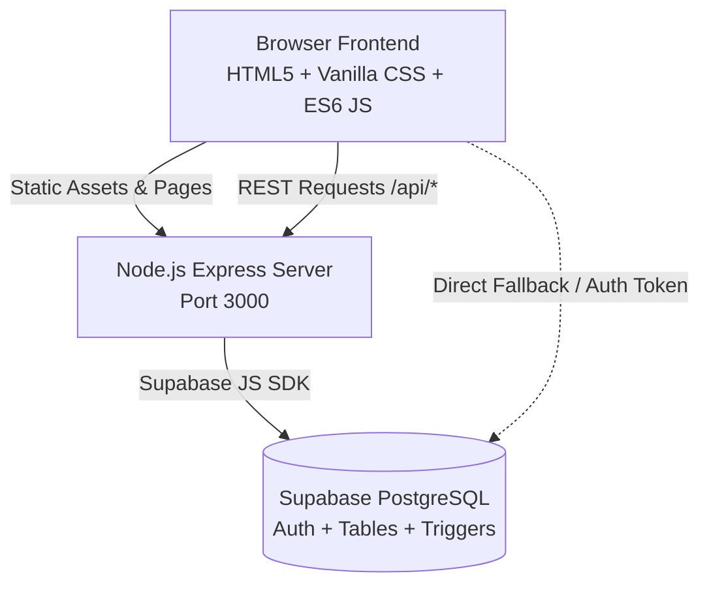

# ☕ AFTERWORD — Community Café & Lending Stacks

> **A friendly modern café with books everywhere, fresh flowers, board games, and events throughout the week. Come in, get comfortable, and stay awhile.**

[](https://nodejs.org/)
[](https://expressjs.com/)
[](https://supabase.com/)
[](https://developer.mozilla.org/en-US/docs/Web/JavaScript)
[](LICENSE)

---

## 📖 Table of Contents
- [About the Project](#-about-the-project)
- [Key Features](#-key-features)
- [System Architecture](#-system-architecture)
- [Project Structure](#-project-structure)
- [Database Schema & Logic](#-database-schema--logic)
- [Getting Started](#-getting-started)
- [API Reference](#-api-reference)
- [Design System & Palette](#-design-system--palette)

---

## 🌟 About the Project

**AFTERWORD** is an all-in-one third place combining:
1. **Specialty Espresso Bar & Bakery**: Single-origin coffees, hand-poured brews, and fresh morning pastries.
2. **The Bookshelf (Lending Library)**: Free in-house reading and 21-day loan privileges for registered patrons.
3. **Botanical Floral Studio**: Fresh morning stems, hand-tied market bunches, and dried arrangements.
4. **Community Gathering Space**: Weekly board game nights, coffee cuppings, flower workshops, and film screenings.

Built with a **zero-bloat, desktop-first responsive design**, using pure semantic HTML5, modular CSS design tokens, vanilla JavaScript, an Express.js REST API, and a Supabase PostgreSQL backend.

---

## ✨ Key Features

### 📚 Interactive Bookshelf & Quickview
- **Click Any Book to Inspect**: Clicking any cover image, title, or card on the homepage or library page opens an instant **Book Details Modal**.
- **Complete Book Information**:
  - High-resolution book cover, shelf location (`Shelf A-01`, `Shelf B-04`, etc.), and real-time copy availability.
  - **Full Story Synopsis** and **"Why It's on the Shelf"** (owner's personal recommendation note).
  - Categorized genre tags (e.g., *Shonen*, *Dark Fantasy*, *Rivals to Lovers*, *Korean Memoir*).
  - Direct **"Borrow Book"** and **"Buy Copy"** action buttons.
- **Dedicated Page**: Standalone overview via `book-details.html?book=<id>` with companion book recommendations.

### 🔄 Book Lending & Circulation Pipeline
- **21-Day Loan Holds**: Patrons can place holds online and pick up books at the circulation desk.
- **Automated Inventory Sync**: PostgreSQL triggers automatically decrement `available_copies` on borrow and increment back on return.
- **Patron Dashboard Actions**:
  - **Renew Loan**: Extends the due date by +14 days.
  - **Return Book**: Marks the book as returned and returns it to the available catalog.

### 🛒 Order Tray & In-Seat Ordering
- **Unified Cart**: Add espresso drinks, pastries, floral bunches, and books into a single slide-out tray.
- **Table Delivery**: Supports both **In-Seat Table Service** (Table #1–16) and **Counter Pickup**.
- **Persistent State**: Order tray state persists in `localStorage` across all pages.

### 👤 Patron Authentication & Profile Portal
- **Aesthetic Split-Screen Login**: Coffee-wave visual layout featuring warm latte art, clean sign-in tabs, and registration.
- **One-Click Demo Patrons**: Instant testing as *Patron Elena*, *Marcus*, or *Dr. Julian*.
- **Patron Dashboard (`profile.html`)**:
  - View currently borrowed books with real-time due date badges (*Due in X days*, *Overdue*).
  - Order history with re-order shortcuts.
  - Workshop & event RSVPs with cancellation options.
  - Patron membership card with custom `#MEM-XXX` patron code.

### 🛡️ Staff Operations Console (`admin.html`)
- Live order pipeline monitoring (`Pending`, `Preparing`, `Ready`, `Completed`).
- Table-side status updates and fulfillment tracking.

---

## 🏛️ System Architecture



---

## 📁 Project Structure

```
AFTERWORD-/
├── backend/
│   ├── .env                       # Supabase URL & Anon Key configuration
│   ├── package.json               # Backend dependencies (express, cors, dotenv, @supabase/supabase-js)
│   └── server.js                  # Express REST API & static file server
│
├── database/
│   ├── schema.sql                 # PostgreSQL DDL, RLS policies, and inventory triggers
│   └── seed.sql                   # Realistic sample data (categories, books, menu, events)
│
├── docs/
│   └── PROJECT_DOCUMENTATION.md   # Comprehensive architectural specification & ER diagrams
│
├── frontend/
│   ├── index.html                 # Main Homepage / Portal
│   ├── login.html                 # Patron Sign In & Account Creation
│   ├── assets/
│   │   └── images/
│   │       ├── books/             # High-res covers (Chainsaw Man, Check & Mate, etc.)
│   │       ├── coffee/            # Cortado, Pour Over, Cold Drip photography
│   │       └── space/             # Interior café ambiance & floral studio
│   ├── styles/
│   │   ├── main.css               # Master stylesheet orchestrator
│   │   ├── variables.css          # Design tokens (palette, typography, spacing)
│   │   ├── base.css               # Reset, typography rules, body styles
│   │   ├── layout.css             # Grid system, header, nav drawer, footer
│   │   ├── buttons.css            # Button variants (.btn-primary, .btn-outline, etc.)
│   │   ├── forms.css              # Inputs, selects, search bars
│   │   ├── components.css         # Cards, chips, badges, order drawer, toasts
│   │   ├── modal.css              # Dialogs, scrims, book quickview layouts
│   │   ├── login.css              # Coffee-wave authentication layout
│   │   ├── profile.css            # Patron dashboard layout and metric cards
│   │   └── responsive.css         # Breakpoint adaptations (tablet & mobile)
│   └── src/
│       ├── js/
│       │   ├── auth.js            # Authentication state & gatekeeper
│       │   ├── book-details.js    # Book database, quickview modal & dynamic controller
│       │   ├── cafe.js            # Table ordering & seat memory
│       │   ├── cart.js            # Order tray drawer, item math & checkout
│       │   ├── filters.js         # Catalog live search & category filters
│       │   ├── modals.js          # Borrow modal, RSVP forms & dialog handles
│       │   ├── navigation.js      # Active nav link highlighter & mobile menu
│       │   ├── profile.js         # Patron profile controller (loans, orders, RSVPs)
│       │   ├── supabase.js        # Universal Supabase client & API wrapper
│       │   ├── toast.js           # Accessible notification engine
│       │   └── main.js            # Frontend orchestrator bootstrap
│       └── pages/
│           ├── cafe.html          # Café menu, espresso bar & table order tray
│           ├── library.html       # Book catalog with live search & filters
│           ├── flowers.html       # Botanical stems, bouquets & arrangements
│           ├── events.html        # Community calendar & workshop RSVPs
│           ├── book-details.html  # Standalone book details view
│           ├── profile.html       # Patron profile dashboard
│           └── admin.html         # Staff operations & order fulfillment console
│
├── CONTEXT.md                     # Living context, state, and change log
└── README.md                      # Project documentation (this file)
```

---

## 🗄️ Database Schema & Logic

The PostgreSQL database is organized into **9 relational tables**:

| Table | Purpose |
|---|---|
| `profiles` | Patron accounts linked to Supabase Auth (`patron_code`, `full_name`, `role`). |
| `categories` | Categorization slugs for café, books, flowers, and events. |
| `books` | Library collection (`title`, `author`, `shelf_location`, `total_copies`, `available_copies`). |
| `products` | Café drinks, pastries, and botanical stems with pricing and stock. |
| `events` | Community calendar entries with dates, times, and venue capacity. |
| `orders` | Table & pickup orders (`order_type`, `table_number`, `subtotal`, `total`, `status`). |
| `order_items` | Line items belonging to an order (`product_id`, `quantity`, `unit_price`). |
| `book_loans` | Circulation records (`book_id`, `user_id`, `status`, `borrowed_at`, `due_date`, `returned_at`). |
| `event_rsvps` | Event seat reservations per patron (`guest_count`, `status`). |

### Automated Inventory Trigger
Whenever a loan is created or marked as returned, PostgreSQL automatically adjusts the shelf inventory:

```sql
CREATE OR REPLACE FUNCTION public.handle_book_loan_inventory()
RETURNS TRIGGER AS $$
BEGIN
    IF (TG_OP = 'INSERT' AND NEW.status = 'Borrowed') THEN
        UPDATE public.books
        SET available_copies = GREATEST(available_copies - 1, 0)
        WHERE book_id = NEW.book_id;
    ELSIF (TG_OP = 'UPDATE' AND OLD.status != 'Returned' AND NEW.status = 'Returned') THEN
        NEW.returned_at := NOW();
        UPDATE public.books
        SET available_copies = LEAST(available_copies + 1, total_copies)
        WHERE book_id = NEW.book_id;
    END IF;
    RETURN NEW;
END;
$$ LANGUAGE plpgsql SECURITY DEFINER;
```

---

## 🚀 Getting Started

### Prerequisites
- [Node.js](https://nodejs.org/) (version 18 or higher)
- [Git](https://git-scm.com/)
- (Optional) A free [Supabase](https://supabase.com/) account for cloud database persistence.

### 1. Clone the Repository
```bash
git clone https://github.com/your-username/AFTERWORD-.git
cd AFTERWORD-
```

### 2. Configure Environment Variables
In `backend/.env`, set your Supabase project credentials:
```ini
PORT=3000
SUPABASE_URL=https://your-project.supabase.co
SUPABASE_KEY=your-anon-or-service-key
```

### 3. (Optional) Run Database Migrations
If connecting to Supabase:
1. Open your Supabase Dashboard -> **SQL Editor**.
2. Run the contents of [`database/schema.sql`](database/schema.sql).
3. Run the contents of [`database/seed.sql`](database/seed.sql) to populate initial books, coffee items, and events.

### 4. Install Backend Dependencies & Start Server
```bash
cd backend
npm install
npm start
```
*For development mode with automatic restarts:*
```bash
npm run dev
```

### 5. Access the Web App
Open your browser and navigate to:
```
http://localhost:3000
```
- **Library Catalog**: `http://localhost:3000/src/pages/library.html`
- **Café & In-Seat Ordering**: `http://localhost:3000/src/pages/cafe.html`
- **Patron Login**: `http://localhost:3000/login.html`
- **Patron Dashboard**: `http://localhost:3000/src/pages/profile.html`
- **Staff Operations Console**: `http://localhost:3000/src/pages/admin.html`

---

## 🔌 API Reference

| Method | Endpoint | Description |
|---|---|---|
| `GET` | `/api/health` | Service diagnostics and database connectivity check |
| `GET` | `/api/books` | List library catalog with optional `?q=` and `?category=` |
| `GET` | `/api/books/:id` | Retrieve single book details |
| `GET` | `/api/products` | Retrieve café menu items and botanical stems |
| `GET` | `/api/events` | List scheduled community events |
| `GET` | `/api/categories` | List catalog categories |
| `POST` | `/api/orders` | Place a new table or pickup order |
| `POST` | `/api/loans` | Borrow a book (creates 21-day loan) |
| `POST` | `/api/loans/:id/return` | Mark a book loan as returned (restores copy) |
| `POST` | `/api/loans/:id/renew` | Extend loan due date by +14 days |
| `POST` | `/api/rsvps` | Reserve an event spot |

---

## 🎨 Design System & Palette

The user interface follows a curated **Modern Warmth & Communal Living** aesthetic:

| Color Token | Hex Code | Role |
|---|---|---|
| `--primary` | `#382922` | Deep Espresso — primary brand headers, prominent buttons, dark accents |
| `--secondary` | `#68705A` | Muted Olive — botanical tags, nature chips, tranquil borders |
| `--terracotta` | `#A65F45` | Warm Terracotta — highlights, active states, hearth accents |
| `--surface-low` | `#FAF7F2` | Warm Cream — background foundation, light card containers |
| `--surface-card` | `#FFFFFF` | Pure White — clean card backgrounds, modal panels |
| `--text-main` | `#252321` | Dark Roast Charcoal — high-contrast, accessible typography |

### Typography
- **Headings & Book Titles**: `Literata` (warm, literary serif)
- **Interface & Body Text**: `Plus Jakarta Sans` (clean, contemporary sans-serif)
- **Metadata, Shelves & Badges**: `Courier Prime` (tactile, typewriter monospace)

---

## 👥 Authors & Acknowledgments
- **Project**: AFTERWORD Community Café, Library & Botanical Hub
- **Final Project**: Integrated Information Technology & Web Systems
- Built with care, craft coffee, and a deep appreciation for physical books.
