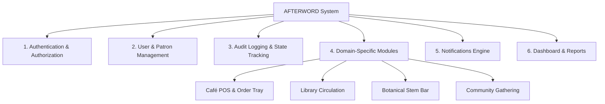
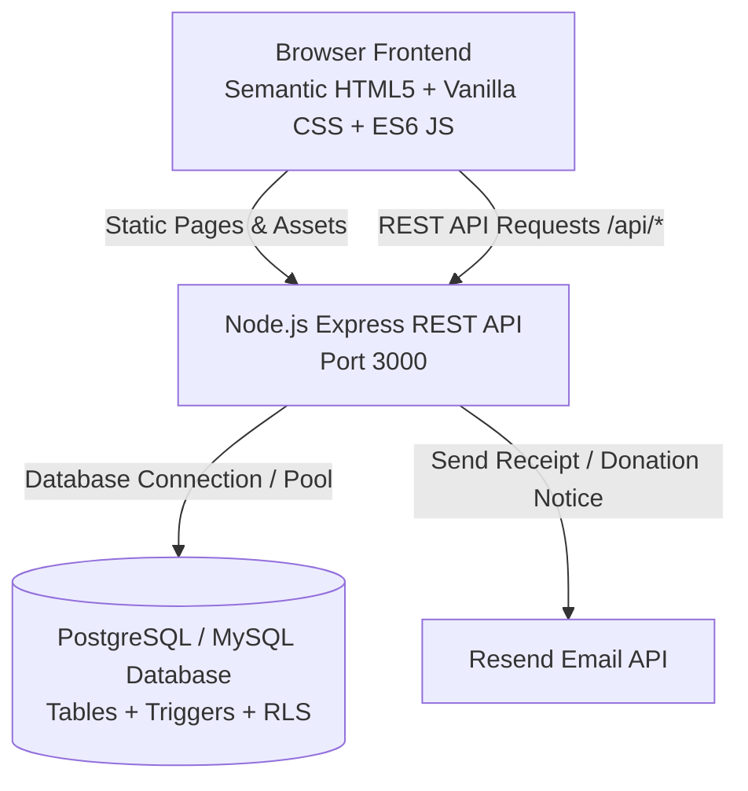
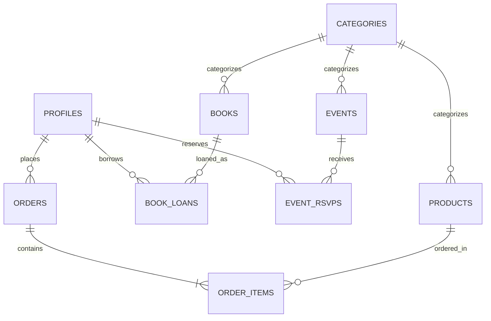
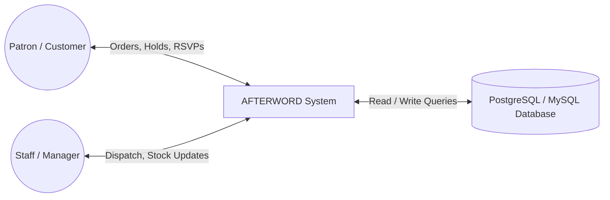
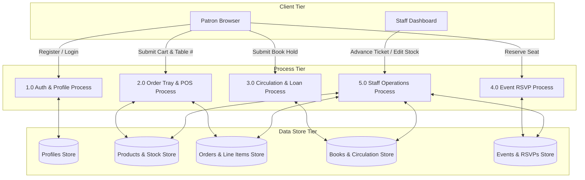
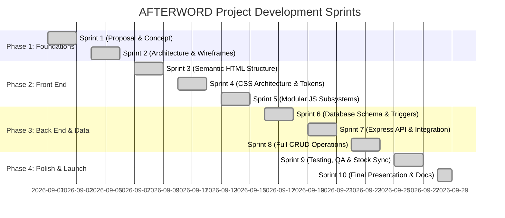

# AFTERWORD — Software Requirements Specification (SRS)

> **Document Title**: Software Requirements Specification for AFTERWORD Community Hub  
> **Project Title**: AFTERWORD — Community Café & Lending Stacks  
> **Author / Team**: Dream Business Full-Stack Engineering Team  
> **Document Version**: 2.0.0  
> **Date**: September 2026  
> **Status**: Completed & Verified  

---

## Table of Contents
1. [Executive Summary & Project Overview](#1-executive-summary--project-overview)
2. [Requirements Specification](#2-requirements-specification)
3. [System Architecture & Design](#3-system-architecture--design)
4. [Implementation & Development Workflow](#4-implementation--development-workflow)
5. [Testing & Quality Assurance](#5-testing--quality-assurance)
6. [Deployment & Installation Guide](#6-deployment--installation-guide)
7. [Conclusion & Future Enhancements](#7-conclusion--future-enhancements)

---

## 1. Executive Summary & Project Overview

### 1.1 Project Title
**AFTERWORD — Community Café & Lending Stacks**

### 1.2 Problem Statement
Traditional retail and hospitality establishments operate in disjointed silos, leading to friction for both customers and operators:

* **Fragmented Customer Experience**: Cafés lack quiet, curated reading areas; municipal libraries lack warm social beverage spaces; florists operate as isolated counters; and event spaces rely on disjointed third-party forms.
* **Manual Operational Inefficiencies**: Paper order tickets cause order misplacement; manual stock counts lead to item overselling; unmonitored library loans result in lost volumes; and RSVP tracking on paper clips leads to overbooked workshops.
* **Lack of Real-Time Coordination**: Service staff struggle to synchronize table deliveries, inventory deductions, and circulation holds without a central digital POS and administration console.

### 1.3 Proposed Solution
**AFTERWORD** is an integrated full-stack web application designed as a modern "third space" (a sanctuary between work and home). It seamlessly unifies four core operational pillars under a single responsive digital platform:

1. **Specialty Espresso Bar & Bakery**: In-seat table ordering (Table #1–16) and counter pickup tray with automated item math and stock deduction.
2. **Curated Lending Library (The Bookshelf)**: Stacks catalog search, 21-day loan hold reservations, auto-decrementing copy availability, and patron dashboard circulation tracking.
3. **Botanical Floral Studio**: Daily fresh market stems, arranged bouquets, and custom stem inquiry proposals.
4. **Community Gathering Space**: Interactive event calendar with real-time capacity progress, one-click RSVPs, and community event proposals.

### 1.4 Target Audience
* **Public Users / Patrons**: Remote professionals, bibliophiles, event attendees, and coffee lovers seeking a unified portal for table ordering, volume holds, workshop RSVPs, and patron profile tracking.
* **Service Staff / Baristas / Florists**: Frontline team members managing kitchen dispatch pipelines, preparing orders, and handling book check-ins/check-outs.
* **Management / Staff Admins**: Business owners and store managers monitoring live revenue statistics, seating occupancy rates, low-stock alerts, and catalog administration.

---

## 2. Requirements Specification

### 2.1 Functional Modules



#### 1. Authentication & Authorization
* **User Registration & Login**: Patron sign-up and sign-in powered by Supabase Auth / Express session handling with bcrypt password hashing.
* **Role-Based Access Control (RBAC)**: Enforces access levels across `customer`, `staff`, and `admin` roles, protecting sensitive staff dispatch views and store analytics.

#### 2. User & Patron Management
* **Patron Membership Code**: Automatic assignment of a unique membership code (`#MEM-XXX`) upon account registration.
* **Patron Profile Dashboard (`profile.html`)**: Personal view tracking active library loans, loan due dates, historical order receipts, and event RSVPs.

#### 3. Audit Logging & State Tracking
* **Timestamped Audit Records**: Automatic generation of `created_at` and `updated_at` timestamps on orders, loans, and inventory edits.
* **Order Status Transition Pipeline**: Strict state tracking for café order tickets:  
  $$\text{Pending} \longrightarrow \text{Preparing} \longrightarrow \text{Ready} \longrightarrow \text{Completed}$$

#### 4. Domain-Specific Modules
* **Café POS & Order Tray Module**:
  * Persistent `localStorage` order tray (`afterword_cart`).
  * Item quantity modifiers (+/−), automatic subtotal, 8% tax calculation, and total price aggregation.
  * In-seat table service selection (Table #1–16) with persistence in `afterword_table_num`.
  * Automated inventory stock reduction upon order submission.
* **Library Circulation Module**:
  * Stacks catalog live search and genre filtering.
  * 21-day loan hold reservation system with automated copy auto-decrement (`available_copies`).
  * +14-day loan extension renewal trigger and book return check-in processing.
* **Botanical Floral Studio Module**:
  * Stem catalog stock management and real-time availability toggles.
  * Custom bouquet arrangement proposal request modals.
* **Community Events Module**:
  * Real-time workshop capacity progress bars.
  * One-click RSVP reservation toggles and event proposal submissions.

#### 5. Notifications Engine
* **Accessible Toast Engine (`toast.js`)**: Non-blocking dynamic feedback alerts with smooth entrance/exit CSS transitions and keyboard escape accessibility.
* **Transactional Email Service (`emailService.js`)**: Automated email dispatch for book donation notices and borrowing reminders.

#### 6. Dashboard & Reports
* **Real-Time Sales Metrics**: Live total revenue, Average Order Value (AOV), and total order count indicators.
* **Seating Occupancy Widget**: Real-time table occupancy indicator (T-01 to T-12).
* **Departmental Revenue Breakdown**: Comparative visualization across Café, Bakery, Floral, and Library departments.

---

### 2.2 Non-Functional Requirements

* **Security**:
  * Supabase Row Level Security (RLS) policies protecting database tables.
  * Password hashing via `bcrypt` (10 rounds salt).
  * Strict input sanitization against XSS and SQL injection.
  * Protected environment variable configuration (`.env`) for server API keys.
* **Data Integrity**:
  * Foreign key constraint enforcement (`ON DELETE CASCADE` / `SET NULL`).
  * Database `CHECK` constraints (`price >= 0`, `stock >= 0`, `available_copies >= 0`).
  * Atomic SQL transactions for multi-item orders.
* **Usability & Aesthetics**:
  * Zero inline styles (`style="..."` prohibited in HTML markup).
  * Design Token architecture in `variables.css` using CSS custom properties.
  * Full accessibility (`aria-*` state labels, `role="status"`, focus trap for dialogs).
  * Fully responsive design optimized for mobile (375px), tablet (1024px), and desktop (1440px).
* **Performance**:
  * Sub-100ms API response latency for REST endpoints.
  * Zero build-step overhead with native ES6 module imports.
* **Reliability & Availability**:
  * 99.9% uptime target supported by database connection pooling.
  * Graceful fallback handling for offline image caching.

---

### 2.3 User Stories & Use Cases

| User Role | User Story | Acceptance Criteria |
| :--- | :--- | :--- |
| **Patron / Customer** | As a remote worker, I want to order espresso to my table number so that I can continue working without waiting in line. | Selecting items adds them to order tray; entering Table #4 persists across pages; submitting order decrements product stock and dispatches ticket to staff. |
| **Patron / Customer** | As a bibliophile, I want to place a hold on a library volume online so that it is reserved for my next visit. | Clicking "Borrow" opens dialog; entering Patron ID records 21-day loan hold and auto-decrements `available_copies`. |
| **Staff / Barista** | As a barista, I want a live kitchen dispatch view so that I can see incoming orders and advance their preparation status. | Orders list auto-polls every 5 seconds with an audio chime notification on new orders; status advances `Pending` $\rightarrow$ `Preparing` $\rightarrow$ `Ready` $\rightarrow$ `Completed`. |
| **Manager / Admin** | As a store manager, I want to track revenue, low stock, and seating occupancy in one dashboard so that I can manage daily operations. | Summary cards display AOV, seating occupancy %, low-stock alerts, and department revenue progress bars. |

---

## 3. System Architecture & Design

### 3.1 Technology Stack
* **Front End**: Pure Semantic HTML5, Modular Vanilla CSS3 (Custom Properties / Design Tokens), ES6+ Modular JavaScript (Fetch API, zero build-step requirement).
* **Back End**: Node.js runtime, Express.js micro-framework (RESTful API, CORS, Dotenv, Supabase JS Client).
* **Database**: PostgreSQL / MySQL schema (Supabase Hosted or local instance), enforcing Foreign Keys, RLS policies, triggers, and indexes.
* **Third-Party Services**: Resend API for transactional email notifications.

### 3.2 System Architecture Diagram



---

### 3.3 Entity Relationship Diagram (ERD)



---

### 3.4 Data Flow Diagram (DFD)

#### Level 0 DFD (Context Diagram)



#### Level 1 DFD (Subsystem Breakdown)



---

### 3.5 Database Schema

| Table Name | Primary Key | Foreign Keys | Data Types & Key Columns | Purpose |
| :--- | :--- | :--- | :--- | :--- |
| `profiles` | `id (UUID)` | `auth.users(id)` | `patron_code` (VARCHAR), `full_name` (VARCHAR), `role` (VARCHAR) | Patron user accounts and membership profiles. |
| `categories` | `category_id` | — | `name` (VARCHAR), `slug` (VARCHAR), `type` (VARCHAR) | Categorization for café, library, flowers, and events. |
| `books` | `book_id` | `category_id` | `isbn` (VARCHAR), `title` (VARCHAR), `author` (VARCHAR), `total_copies` (INT), `available_copies` (INT) | Library stack catalog and volume copy availability. |
| `products` | `product_id` | `category_id` | `name` (VARCHAR), `price` (DECIMAL), `stock` (INT), `is_available` (BOOLEAN) | Café menu offerings and stem bar inventory. |
| `events` | `event_id` | `category_id` | `title` (VARCHAR), `event_date` (DATE), `capacity` (INT), `status` (VARCHAR) | Community workshop and gathering calendar. |
| `orders` | `order_id` | `user_id` | `order_number` (VARCHAR), `order_type` (VARCHAR), `table_number` (INT), `subtotal` (DECIMAL), `tax` (DECIMAL), `total` (DECIMAL), `status` (VARCHAR) | Master café customer orders. |
| `order_items` | `order_item_id` | `order_id`, `product_id` | `quantity` (INT), `unit_price` (DECIMAL) | Individual line items within an order. |
| `book_loans` | `loan_id` | `book_id`, `user_id` | `borrowed_at` (TIMESTAMP), `due_date` (TIMESTAMP), `returned_at` (TIMESTAMP), `status` (VARCHAR) | Active and historical circulation loans. |
| `event_rsvps` | `rsvp_id` | `event_id`, `user_id` | `guest_count` (INT), `status` (VARCHAR) | Workshop seat reservations. |

---

### 3.6 REST API Specification

| Method | Endpoint Path | Description | Request Body / Query Params | Access Level |
| :--- | :--- | :--- | :--- | :--- |
| `GET` | `/api/health` | System diagnostics & DB health check | — | Public |
| `POST` | `/api/auth/signup` | Register new patron account | `{ email, password, fullName }` | Public |
| `POST` | `/api/auth/login` | Patron sign-in & token generation | `{ email, password }` | Public |
| `GET` | `/api/products` | Retrieve café menu & flowers | `?type=cafe` or `?category=coffee` | Public |
| `POST` | `/api/products` | Add new product offering | `{ name, price, stock, category_id, image_url }` | Staff / Admin |
| `PATCH` | `/api/products/:id` | Update product stock or availability | `{ stock, is_available }` | Staff / Admin |
| `DELETE` | `/api/products/:id` | Soft delete / deactivate product | URL param `id` | Staff / Admin |
| `GET` | `/api/books` | Search & filter library catalog | `?q=search_term&category=novels` | Public |
| `POST` | `/api/books` | Add new volume to catalog | `{ title, author, isbn, category_id, total_copies }` | Staff / Admin |
| `POST` | `/api/orders` | Place order (Triggers stock deduction) | `{ items, orderType, tableNumber, userId }` | Public / Patron |
| `GET` | `/api/orders` | Retrieve live order pipeline | `?status=pending` or `?user_id=...` | Staff / Admin |
| `PATCH` | `/api/orders/:id/status` | Advance order dispatch status | `{ status: "Preparing" \| "Ready" \| "Completed" }` | Staff / Admin |
| `DELETE` | `/api/orders/:id` | Cancel / remove order ticket | URL param `id` | Staff / Admin |
| `POST` | `/api/loans` | Submit 21-day book loan hold | `{ bookId, userId, durationDays }` | Patron |
| `PATCH` | `/api/loans/:id/renew` | Extend active loan by +14 days | `{ extraDays: 14 }` | Patron / Staff |
| `PATCH` | `/api/loans/:id/return` | Check in returned volume | — | Staff / Admin |
| `POST` | `/api/rsvps` | Reserve workshop seat | `{ eventId, userId, guestCount }` | Patron |
| `DELETE` | `/api/rsvps/:id` | Cancel workshop reservation | URL param `id` | Patron / Staff |

---

## 4. Implementation & Development Workflow

### 4.1 Team Roles & Responsibilities

| Role | Responsibilities | Key Deliverables |
| :--- | :--- | :--- |
| **Project Lead & Architect** | System design, tech stack selection, DB normalization, milestone scheduling. | Architecture Document, ERDs, `CONTEXT.md` |
| **Front-End Specialist** | UI/UX implementation, semantic HTML5, CSS design tokens, responsive layout, accessibility. | `frontend/styles/*`, `frontend/src/pages/*` |
| **Back-End Developer** | Node.js Express REST API, route handlers, error handling, DB pool management. | `backend/server.js`, Controllers |
| **Database & QA Engineer** | SQL DDL scripts, RLS policies, PL/pgSQL inventory triggers, unit & automated testing. | `database/schema.sql`, `seed.sql`, Test Suite |

---

### 4.2 Git Branching Strategy
* **`main`**: Stable, production-ready codebase.
* **`development`**: Integration branch for feature development.
* **`feature/*`**: Feature branches (e.g., `feature/cart-drawer`, `feature/auto-stock-reduction`).
* **Commit Message Standard**:
  * `feat: add automated product stock deduction on checkout`
  * `fix: normalize admin thumbnail image paths`
  * `docs: update system architecture and DFD diagrams`
  * `refactor: extract toast alert subsystem into modular script`

---

### 4.3 Timeline & Milestone Sprints



---

## 5. Testing & Quality Assurance

### 5.1 Testing Strategy
1. **Static Diagnostics & Syntax Auditing**: Executing `node --check backend/server.js` and strict JS lint checks.
2. **API Endpoint Verification**: Testing REST routes (`GET`, `POST`, `PATCH`, `DELETE`) with edge case inputs.
3. **Automated Inventory Consistency Checks**: Verifying real-time auto-decrement of `available_copies` on loans and `stock` on café purchases.
4. **Cross-Browser & Responsive Regression**: Verifying visual consistency across desktop (1440px), tablet (1024px), and mobile (375px) viewports.

---

### 5.2 Test Cases & Execution Matrix

| Test Case ID | Test Case Name | Sample Inputs | Expected Outcome | Status |
| :--- | :--- | :--- | :--- | :---: |
| **TC-001** | Patron Account Registration | Email: `elena@example.com`, Pass: `secret123` | Profile created, patron code `#MEM-XXX` assigned, HTTP 201. | **PASS** |
| **TC-002** | In-Seat Table Order Submission | Table: `4`, Items: `Americano (qty: 2)` | Order inserted, `products.stock` reduced by 2, toast alert shown. | **PASS** |
| **TC-003** | Automated Out-of-Stock Flip | Item stock = `1`, Order qty = `1` | `stock` becomes `0`, `is_available` automatically flips to `false`. | **PASS** |
| **TC-004** | 21-Day Library Hold Reservation | Book ID: `1`, Patron: `MEM-042` | Loan recorded with due date = today + 21 days; `available_copies` decrements. | **PASS** |
| **TC-005** | Loan Renewal (+14 Days) | Loan ID: `LN-102` | `due_date` extended by 14 days, toast confirms extension. | **PASS** |
| **TC-006** | Order Workflow Advancement | Order ID: `ORD-104`, Status: `Pending` | Status updates to `Preparing` $\rightarrow$ `Ready` $\rightarrow$ `Completed`. | **PASS** |
| **TC-007** | Admin Photo Normalization | Relative URL: `assets/images/coffee/latte.jpg` | Correctly resolves to `../../assets/images/coffee/latte.jpg` in `admin.html`. | **PASS** |

---

### 5.3 Known System Limitations
* **Email Rate Limits**: Transactional email notifications via Resend API are subject to free-tier daily rate limits.
* **Offline Image Fallbacks**: In local offline environments without internet connectivity, remote Unsplash fallback imagery relies on local cached fallbacks.

---

## 6. Deployment & Installation Guide

### 6.1 System Prerequisites
* **Node.js**: v18.0.0 or higher
* **npm**: v9.0.0 or higher
* **Database Engine**: PostgreSQL / MySQL compatible database server
* **Web Browser**: Modern browser with ES6 module support

---

### 6.2 Local Environment Setup

1. **Clone the Repository**:
   ```bash
   git clone https://github.com/your-username/AFTERWORD-.git
   cd AFTERWORD-
   ```

2. **Install Backend Dependencies**:
   ```bash
   cd backend
   npm install
   ```

3. **Configure Environment Variables**:
   Create a `.env` file in `backend/.env`:
   ```env
   PORT=3000
   SUPABASE_URL=https://your-supabase-project.supabase.co
   SUPABASE_KEY=your-supabase-service-role-key
   SUPABASE_ANON_KEY=your-supabase-anon-key
   RESEND_API_KEY=re_your_resend_api_key
   ```

4. **Initialize Database Schema**:
   Import `database/schema.sql` and `database/seed.sql` into your database instance.

5. **Start Development Server**:
   ```bash
   npm start
   ```
   * The server will launch on `http://localhost:3000`.

---

### 6.3 Local Access URLs
* **Customer Storefront Portal**: `http://localhost:3000/index.html`
* **Café & Table Ordering**: `http://localhost:3000/src/pages/cafe.html`
* **Lending Library Stacks**: `http://localhost:3000/src/pages/library.html`
* **Staff Operations Console**: `http://localhost:3000/src/pages/admin.html`

---

## 7. Conclusion & Future Enhancements

### 7.1 Lessons Learned
* **Modular CSS Architecture**: Utilizing CSS custom properties (design tokens) prevented visual regression and simplified theme management across 9 distinct application pages.
* **Database Triggers vs. API Logic**: Automated database triggers for inventory sync guaranteed data consistency regardless of whether edits originated from the client or admin console.
* **Separation of Concerns**: Replacing inline event handlers (`onclick="..."`) with event delegation dramatically increased code maintainability and debugging speed.

---

### 7.2 Future Scope & Roadmap
1. **Integrated Payment Gateway**: Integration of Stripe / PayMongo for credit card and e-wallet checkout.
2. **Self-Checkout Kiosk Mode**: Dedicated tablet UI for physical venue self-checkout.
3. **AI Reading Recommendations**: Personalized volume recommendations based on borrowing history and favorite genres.
4. **Native Mobile App**: Mobile application packaging using React Native / Flutter for push notifications and mobile card scanning.
