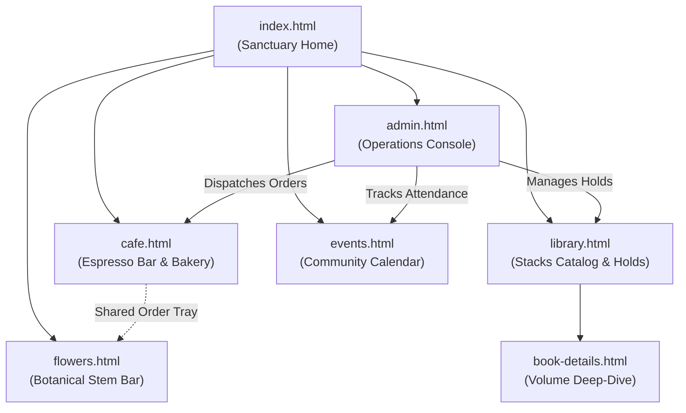
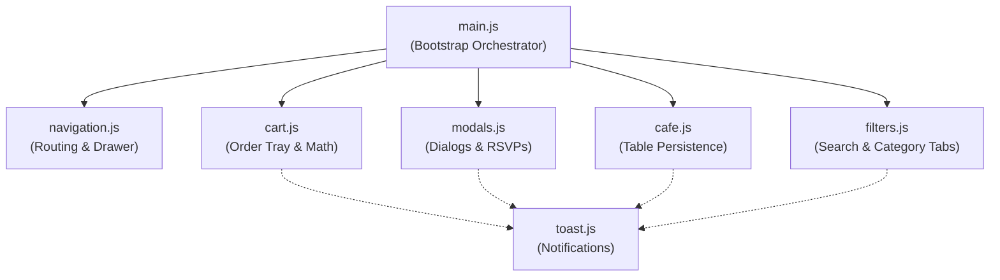
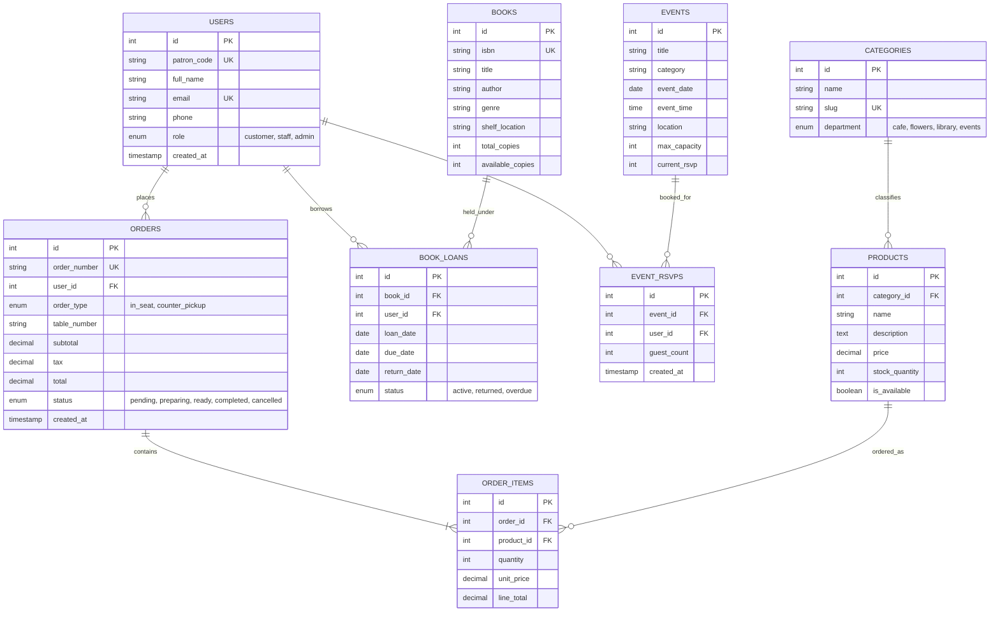

# AFTERWORD Community Hub — Full-Stack Web Application
## Comprehensive Project Documentation & Technical Architecture Manual

> **Term Project**: Dream Business Full-Stack Web Application  
> **Business Name**: AFTERWORD Community Hub  
> **Concept**: Multi-faceted Cultural Sanctuary (Specialty Espresso Café, Curated Lending Library, Botanical Stem Bar, Community Event Gathering Space)  
> **Course / Track**: Full-Stack Web Application Development (HTML5 · CSS3 · Vanilla JS · Node.js/Express · MySQL)  
> **Living Document Version**: 1.0.0  

---

## Table of Contents
1. [Executive Summary & Business Overview](#1-executive-summary--business-overview)
2. [Milestone 1: Dream Business Proposal & Planning](#2-milestone-1-dream-business-proposal--planning)
3. [Milestone 2: Information Architecture, Sitemap & Wireframes](#3-milestone-2-information-architecture-sitemap--wireframes)
4. [Milestone 3: Semantic HTML5 Structure & Page Specifications](#4-milestone-3-semantic-html5-structure--page-specifications)
5. [Milestone 4: Design Tokens, CSS Architecture & Responsive Styling](#5-milestone-4-design-tokens-css-architecture--responsive-styling)
6. [Milestone 5: Client-Side JavaScript Subsystems & Function Deep-Dive](#6-milestone-5-client-side-javascript-subsystems--function-deep-dive)
7. [Milestone 6: Relational Database Design & MySQL Schema](#7-milestone-6-relational-database-design--mysql-schema)
8. [Milestone 7: Back-End Architecture & RESTful API Specification](#8-milestone-7-back-end-architecture--restful-api-specification)
9. [Milestone 8: CRUD Implementation Matrix](#9-milestone-8-crud-implementation-matrix)
10. [Milestone 9: Input Validation, Error Handling & System Integration](#10-milestone-9-input-validation-error-handling--system-integration)
11. [Milestone 10: Final Demonstration Guide & Presentation Defense](#11-milestone-10-final-demonstration-guide--presentation-defense)
12. [Project File Map & Quick Reference](#12-project-file-map--quick-reference)

---

## 1. Executive Summary & Business Overview

### 1.1 The Concept: What is AFTERWORD?
**AFTERWORD** is conceptualized as an intentional neighborhood **"third space"**—a cultural sanctuary situated between work and home. Rather than existing as a transactional single-purpose venue, AFTERWORD integrates four interweaving experiences under one roof:

1. **Specialty Espresso Café**: Artisanal single-origin brews, house-crafted cortados, and wood-fired pastries, ordered either at the counter or delivered directly in-seat via table numbering.
2. **Curated Lending Library**: Open stacks of architectural volumes, design anthologies, philosophy texts, and literature, available for browsing and patron-card holds.
3. **Botanical Stem Bar**: Daily market stems, structured floral arrangements, and loose botanical foliage curated by in-house florists.
4. **Community Event Gathering Space**: Evening book clubs, slow coffee tastings, floral workshops, and cultural symposiums with interactive RSVP booking.

### 1.2 Technology Stack
* **Front End**: Pure Semantic HTML5, Modular CSS3 (Design Tokens, CSS Custom Properties, Responsive Grid & Flexbox), Modern ES6+ JavaScript (Zero build step, vanilla modular modules, compatible with local filesystem and web servers).
* **Back End**: Node.js runtime with Express.js micro-framework (RESTful JSON API endpoints, routing, parameter validation, database connection pooling).
* **Database**: MySQL Relational Database (`MySQL80` service), enforcing foreign keys, referential integrity, indexes, and normalized tables.
* **Design Philosophy**: Warm editorial aesthetic inspired by print journals, archival linen, dark espresso wood tones, and natural greenery. Zero inline styling (`style="..."`), complete separation of concerns, and accessible keyboard navigation.

---

## 2. Milestone 1: Dream Business Proposal & Planning

### 2.1 Business Profile
* **Business Name**: AFTERWORD Community Hub
* **Tagline**: *"Coffee. Books. Flowers. Games. Whatever's happening today."*
* **Core Value Proposition**: A physical and digital sanctuary providing a deliberate, human-paced environment where patrons can enjoy specialty beverages, borrow curated books, arrange seasonal flowers, and gather for cultural events.

### 2.2 Target Demographics & Customer Personas
1. **The Remote Scholar / Creative Professional**: Seeks an inspiring, quiet workstation with premium single-origin coffee, fast Wi-Fi, and table service.
2. **The Avid Reader & Bibliophile**: Desires a community-run alternative to municipal libraries with curated reading lists, design books, and hassle-free hold reservations.
3. **The Neighborhood Gatherer**: Participates in weekend floral workshops, acoustic nights, and evening book clubs.
4. **The Floral Enthusiast**: Hand-selects daily stems or pre-orders seasonal arrangements for personal spaces or gifting.

### 2.3 Proposed Website Features
* **Live In-Seat Table Ordering**: Patrons enter their table number to have espresso and pastries brought directly to their workspace.
* **Stack Circulation & Book Holds**: Patrons can browse real-time library availability, inspect volume details, and place hold requests using their Patron Card ID.
* **Botanical Stem Bar Order Tray**: Customers can mix and match flower stems, view live stock, and calculate subtotal/tax automatically.
* **Interactive Community Calendar**: Patrons can inspect event capacities, reserve seats with one-click toggles, or propose their own community event.
* **Comprehensive Staff Operations Console**: An administrative dashboard for real-time order dispatch, inventory adjustments, book circulation tracking, and patron oversight.

### 2.4 Primary Business Transactions
1. **Café / Floral Ordering**: Customer selects items $\rightarrow$ Items added to persistent slide-over Order Tray $\rightarrow$ Table number or counter pickup chosen $\rightarrow$ Real-time tax and total calculated $\rightarrow$ Order submitted.
2. **Library Stacks Hold**: Customer searches/filters catalog $\rightarrow$ Selects book $\rightarrow$ Opens Hold Dialog $\rightarrow$ Chooses loan duration and enters Patron ID $\rightarrow$ Reservation recorded.
3. **Event RSVP Booking**: Customer inspects date and capacity $\rightarrow$ Toggles RSVP $\rightarrow$ Seat count incremented.

---

## 3. Milestone 2: Information Architecture, Sitemap & Wireframes

### 3.1 Sitemap & Navigation Hierarchy



### 3.2 Wireframe Blueprint Reference
Wireframe specifications were drafted under `WireFrame/stitch_afterword_community_hub/` and `WireFrame/with color/`:
* **Header Architecture**: Fixed desktop bar with logo brandmark, primary route navigation, global search input (`library.html?q=...`), and an interactive Cart/Tray trigger showing a live numeric badge.
* **Mobile Drawer**: Responsive off-canvas slide-in navigation drawer for screens $\le 768\text{px}$, toggled by a floating hamburger menu button with full ARIA attributes.
* **Slide-over Tray Drawer**: Right-anchored overlay drawer that smoothly slides into view whenever a patron clicks the order tray icon, showing order rows, quantity modifiers, tax breakdown, and clear/checkout actions.

---

## 4. Milestone 3: Semantic HTML5 Structure & Page Specifications

The front end strictly adheres to **Semantic HTML5**. Generic `<div>` containers were systematically minimized in favor of semantic elements that define meaningful document layout:
* `<header>`: Encloses branding, top-level navigation, and global tools.
* `<nav>`: Hosts navigation links and category tab bars.
* `<main>`: Wraps the unique primary content of each document.
* `<section>`: Divides distinct thematic units (Hero, Featured Stacks, Menu Sections).
* `<article>`: Encapsulates standalone, distributable entities (Menu cards, Book items, Event cards).
* `<aside>`: Used for the Slide-Over Cart Drawer, Table Number persistence card, and sidebar navigation.
* `<footer>`: Contains secondary navigation, hours of operation, address, and legal colophon.

### 4.1 Page-by-Page HTML Blueprint

| Page | Relative Path | Purpose & Key Semantic Sections |
| :--- | :--- | :--- |
| **Sanctuary Home** | `frontend/index.html` | **Hero Section** with brand identity; **Today at AFTERWORD** live status strip (Current seating capacity, hours, active brews); **Four Parts of One Place** grid linking to the 4 departments; **What's Happening** featured events; **Personal Bookshelf** library highlights; **Fresh Flowers** showcase; **Community Colophon** footer. |
| **Café Menu** | `frontend/src/pages/cafe.html` | **Table Delivery Header** with `<input id="table-number-input">`; **Category Tab Bar** (`#cafe-tabs`); **Espresso & Beverage Section** with `.menu-item-card` elements; **Bakery & Hearth Section**; **Persistent Sticky Tray Floating Bar** showing real-time item counts and totals. |
| **Library Stacks** | `frontend/src/pages/library.html` | **Catalog Header** with `#library-search` input and `#library-results-count` badge; **Departmental Filter Tabs** (`#library-tabs`: All, Design & Arch, Philosophy, Literature, Visual Arts); **Stacks Grid** of `.book-item-card` articles with cover art, metadata badges, and Hold buttons. |
| **Volume Details** | `frontend/src/pages/book-details.html` | **Breadcrumb Navigation**; **Volume Hero** with dual-column layout (Left: Archival cover & loan status; Right: Title, author, synopsis, shelf location, and direct Hold modal CTA); **Reading List** toggle button. |
| **Botanical Bar** | `frontend/src/pages/flowers.html` | **Stem Bar Hero**; **Seasonal Arrangement Grid** with `.flower-item-card` items; **Custom Stem Builder** instructions; **Florist Consultation Inquiry** card. |
| **Events Calendar** | `frontend/src/pages/events.html` | **Calendar Header** with `#events-search` and `#events-tabs` (All, Workshops, Gatherings, Book Clubs); **Event Cards Grid** (`.event-card-item`) with date badges, attendee progress bars, and one-click quick RSVP buttons; **Propose an Event** CTA banner. |
| **Operations Console** | `frontend/src/pages/admin.html` | **Desktop-First Administrative Shell**: Fixed sidebar (`.admin-sidebar`) with 8 views (Dashboard, Orders Dispatch, Café Inventory, Flowers, Stacks Circulation, Events Roster, Patron Directory, Analytics); Multi-column status tables with inline status control badges. |

---

## 5. Milestone 4: Design Tokens, CSS Architecture & Responsive Styling

The application uses an enterprise-grade **Modular Vanilla CSS Architecture** located in `frontend/styles/`. All styles are orchestrated through a single entry point (`main.css`) using `@import` directives.

### 5.1 Design Tokens (`variables.css`)
All visual styling strictly references CSS Custom Properties to maintain design consistency and avoid arbitrary hardcoded values:

```css
:root {
  /* Color Palette */
  --forest: #2C402E;         /* Primary brand green: warmth, quiet, growth */
  --forest-light: #3D5A40;   /* Hover states and secondary highlights */
  --espresso: #2B2118;       /* Deep coffee tone for headers and high-contrast text */
  --sand: #F7F4EE;           /* Warm parchment background canvas */
  --sand-card: #FFFFFF;      /* Clean card and modal background */
  --linen: #ECE7DE;          /* Subtle borders, input backgrounds, table strips */
  --crema: #E8DFD1;          /* Accent tone for badges and subtle banners */
  --rust: #A34E36;           /* Terracotta accent for urgent alerts and badges */
  --sage: #7D8D78;           /* Muted foliage tone for secondary metadata */
  --text-primary: #1F1D1A;   /* Primary body text color */
  --text-muted: #6E685E;     /* Captions, timestamps, and secondary labels */

  /* Typography Scale */
  --font-display: 'Playfair Display', serif; /* Classic, editorial serif for headings */
  --font-body: 'Inter', sans-serif;          /* High-legibility sans-serif for UI & body */
  --font-mono: 'JetBrains Mono', monospace;  /* Monospace for IDs, timestamps, table numbers */

  /* Spacing Tokens */
  --spacing-xs: 4px;   --spacing-sm: 8px;   --spacing-md: 16px;
  --spacing-lg: 24px;  --spacing-xl: 32px;  --spacing-2xl: 48px;

  /* Elevation Shadows */
  --shadow-sm: 0 1px 3px rgba(43, 33, 24, 0.06);
  --shadow-md: 0 4px 12px rgba(43, 33, 24, 0.08);
  --shadow-lg: 0 12px 32px rgba(43, 33, 24, 0.12);
}
```

### 5.2 CSS File Organization & Responsibilities
1. **`variables.css`**: Master repository of design tokens (colors, typography, radii, elevations, transition speeds).
2. **`base.css`**: Clean CSS normalization reset, baseline font rendering, smoothing rules, and default heading styles (`h1` through `h6`).
3. **`layout.css`**: Defines layout structures: `.site-header`, `.site-footer`, 12-column `.grid`, `.grid-4`, `.grid-3`, `.grid-2`, and `.container`.
4. **`buttons.css`**: Standardized interactive button classes:
   * `.btn-primary`: Solid forest green with subtle elevation and scale transitions.
   * `.btn-secondary`: Outlined parchment button with crisp border.
   * `.btn-ghost`: Minimalist text-only button with hover background.
   * `.btn-sm`, `.btn-lg`, and icon alignment utilities.
5. **`forms.css`**: Inputs (`input[type="text"]`, `input[type="number"]`), textareas, selects, focus rings (`outline: 2px solid var(--forest)`), and input error feedback.
6. **`components.css`**: Encapsulates self-contained UI components:
   * `.card`: Elevated surface with rounded borders and padding.
   * `.badge` / `.chip`: Pill tags for categories and stock status.
   * `.cart-drawer` & `.cart-overlay`: Slide-over order tray drawer.
   * `.toast-container` & `.toast`: Animated alert banners.
7. **`modal.css`**: Dialog system featuring `.modal-scrim` (backdrop blur scrim) and `.modal-dialog` (spring-animated dialog card with exit controls).
8. **`responsive.css`**: Media queries delivering responsive layouts across all devices:
   * **Desktop ($\ge 1025\text{px}$)**: Full multi-column grids, fixed top navigation, expanded layout.
   * **Tablet ($769\text{px} - 1024\text{px}$)**: 2-column card adaptations, condensed spacing.
   * **Mobile ($\le 768\text{px}$)**: Single-column stacked flows, off-canvas navigation drawer, full-width touch buttons.
9. **`admin.css`**: Enterprise dashboard styling: fixed collapsible sidebar, metrics KPI cards, scrollable data tables, and status pill badges.

---

## 6. Milestone 5: Client-Side JavaScript Subsystems & Function Deep-Dive

All client-side JavaScript is written in **Modular ES6+** across 7 dedicated modules in `frontend/src/js/`. It requires **no build tools or bundlers**, runs directly in standard browsers, and relies on **event delegation** to eliminate inline JavaScript (`onclick`, `onsubmit`).

### 6.1 Module Architecture Diagram



---

### 6.2 Cart & Order Tray Subsystem (`cart.js`)
Manages state, calculations, browser `localStorage` persistence, and rendering for the slide-over order tray.

* `cart` (Array): Global in-memory collection of tray items: `[{ name, price, category, quantity }]`.
* `loadCart()`:
  * Reads the serialized JSON string from `localStorage.getItem('afterword_cart')`.
  * Safely parses JSON with `try...catch` fallback to empty array.
  * Calls `updateCartUI()` to synchronize badges and drawer.
* `saveCart()`:
  * Serializes `cart` array into JSON and writes to `localStorage.setItem('afterword_cart', ...)`.
  * Triggers immediate UI updates across all count indicators.
* `getCartCount()` $\rightarrow$ `number`:
  * Returns cumulative sum of item quantities using `cart.reduce((sum, item) => sum + item.quantity, 0)`.
* `getCartTotal()` $\rightarrow$ `number`:
  * Computes pre-tax order subtotal: $\sum (\text{item.price} \times \text{item.quantity})$.
* `addToCart(item)`:
  * Evaluates whether `item.name` already exists in `cart`.
  * If found: increments `existing.quantity += 1`.
  * If new: pushes new object `{ name, price, category, quantity: 1 }`.
  * Saves to storage and calls `bounceBadge()`.
* `updateCartQuantity(index, change)`:
  * Modifies quantity by `+1` or `-1` at specific array index.
  * If quantity reaches `0`: removes item from array using `cart.splice(index, 1)`.
  * Persists to storage.
* `bounceBadge()`:
  * Selects all `.cart-count-badge` elements, removes `.badge-bounce`, forces CSS reflow via `void badge.offsetWidth`, and reapplies `.badge-bounce` for a micro-interaction animation.
* `updateCartUI()`:
  * Updates numerical text in `.cart-count-badge`.
  * Updates in-page sticky bar label (`.tray-item-count`).
  * Calls `renderCartItems()`.
* `renderCartItems()`:
  * Targets `#cart-items-container`.
  * If empty: renders an empty state with an icon and hint message.
  * If items exist: generates dynamic HTML rows with item name, category, unit price, quantity increment/decrement buttons, and total line price.
  * Calculates and updates `#cart-subtotal`, `#cart-tax` ($8\%$), and `#cart-total`.
* `openCart()` / `closeCart()`:
  * Adds/removes the `.open` class on `#cart-overlay` and `#cart-drawer`.
* `initCart()`:
  * Attaches event listeners to open/close buttons, clear cart button, and checkout button.
  * Implements **event delegation** on `#cart-items-container` for `[data-qty-action="increase"]` and `[data-qty-action="decrease"]`.
  * Attaches global document click listener for all `[data-add-to-cart]` buttons.

---

### 6.3 Filter & Live Search Subsystem (`filters.js`)
Provides instant, client-side live search and multi-criteria category filtering for the library stacks, café menu, and event calendar.

* `initFilters()`:
  * Bootstraps category tabs, library search listeners, and event calendar listeners.
* `setupCategoryTabs()`:
  * Attaches click handlers to `.tab-bar .tab-btn`.
  * Toggles `.active` class state among siblings.
  * Dispatches filtering to specialized functions (`applyLibraryFilters` or `applyEventFilters`) or generic `filterElements`.
* `filterElements(attrName, category)`:
  * Iterates over target cards and compares `element.getAttribute(attrName)` with chosen category.
  * **Safety Guard**: Specifically protects navigation headers, tab bars, and tab buttons from ever being set to `display: none`.
* `setupLibraryFilters()` & `applyLibraryFilters()`:
  * Reads optional incoming URL parameter `?q=...` to automatically populate the search input.
  * Listens to live `input` events on `#library-search`.
  * Evaluates both text query (matching title or author, case-insensitive) AND selected category tab (`data-category`).
  * Toggles card visibility (`display: ''` vs `display: 'none'`).
  * Updates live badge `#library-results-count` (e.g., *"Showing 8 Volumes"*).
* `setupEventFilters()` & `applyEventFilters()`:
  * Evaluates event title against `#events-search` input and active category tab (`#events-tabs`).
  * Updates live count `#events-results-count`.

---

### 6.4 Modals & RSVP Subsystem (`modals.js`)
Controls popup dialogs, loan hold forms, community event proposals, and RSVP button states.

* `openModal(modalEl)`:
  * Adds `.open` class, sets `aria-hidden="false"`, and sets `document.body.style.overflow = 'hidden'` to prevent background scroll-jacking.
* `closeModal(modalEl)` & `closeAllModals()`:
  * Removes `.open` class, sets `aria-hidden="true"`, and restores body scrolling.
* `openBorrowModal(bookTitle)` & `closeBorrowModal()`:
  * Dynamically populates `#modal-book-title` with the clicked volume name and opens `#borrow-modal`.
* `initBorrowModal()`:
  * Binds triggers `[data-action="open-borrow-modal"]` to extract `data-book-title`.
  * Intercepts `#borrow-form` submit: prevents page reload, captures loan duration and Patron ID, dismisses modal, and shows confirmation toast.
* `initEventModal()`:
  * Intercepts `#event-proposal-form` submissions and shows success toast.
* `initQuickRsvpButtons()`:
  * Binds click handlers to `[data-action="quick-rsvp"]`.
  * Toggles button classes between `.btn-primary` (*"RSVP / Reserve"*) and `.btn-secondary` (*"✓ Spot Reserved"*).
* `initModals()`:
  * Binds click events on `.modal-scrim` (clicking the dark backdrop closes the modal).
  * Listens for `Escape` keyboard press to dismiss open modals.
  * Binds global action delegates (`enroll-patron`, `inquire-floral`, `add-reading-list`).

---

### 6.5 Café Table Service Subsystem (`cafe.js`)
* `initCafeTable()`:
  * Checks `localStorage` for `afterword_table_num`.
  * If found: pre-populates `#table-number-input`.
  * Listens for `change` events on `#table-number-input`:
    * If table number provided: stores in `localStorage` and triggers toast: *"Delivering in-seat orders to Table #X"*.
    * If cleared: removes from `localStorage` and triggers toast: *"Switched to Counter Pickup"*.

---

### 6.6 Navigation & Routing Subsystem (`navigation.js`)
* `initNavigation()`:
  * Bootstraps route link highlight, mobile drawer toggle, and global search bar routing.
* `highlightActiveNavLink()`:
  * Evaluates `window.location.pathname` against all `.nav-link` anchors.
  * Applies `.active` class to matching desktop and mobile links.
* `setupMobileDrawer()`:
  * Binds click events to `.mobile-menu-btn` to toggle `.mobile-nav-drawer.open`.
  * Updates `aria-expanded` and switches Material Symbol between `'menu'` and `'close'`.
* `setupHeaderSearch()`:
  * Listens for `Enter` keypress on the top header search bar:
    * If already on `library.html`: synchronizes `#library-search` and triggers live search.
    * If on another page: redirects to `library.html?q={query}`.

---

### 6.7 Toast Notification Engine (`toast.js`)
* `showToast(message, icon)`:
  * Ensures `#toast-container` exists in DOM with `aria-live="polite"`.
  * Creates an accessible toast card `<div class="toast" role="status">` with an icon and message.
  * Smoothly slides in using `requestAnimationFrame` and CSS class `.show`.
  * Automatically fades out and cleans up from DOM after 3.2 seconds.

---

### 6.8 Application Bootstrap (`main.js`)
* Sequentially initializes all client-side subsystems inside `DOMContentLoaded`:
  ```javascript
  document.addEventListener('DOMContentLoaded', () => {
    initNavigation();
    initCart();
    initFilters();
    initModals();
    initCafeTable();
  });
  ```

---

### 6.9 Administrative Console Subsystem (`admin.js`)
Powers the staff management interface in `admin.html`:
* `initAdminNavigation()`: Switches views without page reloads (Dashboard, Orders, Café, Flowers, Library, Events, Customers, Analytics, Settings).
* `renderOrdersTable()` & `advanceOrderStatus(orderId)`: Live dispatch pipeline transitioning orders from `pending` $\rightarrow$ `preparing` $\rightarrow$ `ready` $\rightarrow$ `completed` or `cancelled`.
* `renderCafeTable()` & `adjustStock(id, delta)`: Real-time inventory adjustments with low-stock threshold warnings.
* `toggleAvailability(id)`: Toggles item availability switch (`Available` vs `Sold Out`).
* `renderLibraryTable()` & `openReservationsModal()`: Stacks circulation tracking, copy availability, and patron hold queues.
* `renderEventsTable()`: Community gathering roster tracking and capacity percentage progress bars.

---

## 7. Milestone 6: Relational Database Design & MySQL Schema

The database for AFTERWORD is designed in **MySQL** (`MySQL80` engine), implementing third normal form (3NF), primary keys, foreign key constraints, indexes, and appropriate data types.

### 7.1 Entity Relationship Diagram (ERD)



### 7.2 Database Table Specifications

1. **`users`**:
   * `id`: `INT AUTO_INCREMENT PRIMARY KEY`
   * `patron_code`: `VARCHAR(30) UNIQUE NOT NULL` (e.g., `'MEM-042'`)
   * `full_name`: `VARCHAR(100) NOT NULL`
   * `email`: `VARCHAR(120) UNIQUE NOT NULL`
   * `phone`: `VARCHAR(25)`
   * `role`: `ENUM('customer', 'staff', 'admin') DEFAULT 'customer'`
   * `created_at`: `TIMESTAMP DEFAULT CURRENT_TIMESTAMP`
2. **`categories`**:
   * `id`: `INT AUTO_INCREMENT PRIMARY KEY`
   * `name`: `VARCHAR(60) NOT NULL`
   * `slug`: `VARCHAR(60) UNIQUE NOT NULL`
   * `department`: `ENUM('cafe', 'flowers', 'library', 'events') NOT NULL`
3. **`products`** (Café menu items and botanical stems):
   * `id`: `INT AUTO_INCREMENT PRIMARY KEY`
   * `category_id`: `INT NOT NULL`, Foreign Key $\rightarrow$ `categories(id)`
   * `name`: `VARCHAR(120) NOT NULL`
   * `description`: `TEXT`
   * `price`: `DECIMAL(10,2) NOT NULL`
   * `stock_quantity`: `INT DEFAULT 0`
   * `is_available`: `TINYINT(1) DEFAULT 1`
4. **`orders`**:
   * `id`: `INT AUTO_INCREMENT PRIMARY KEY`
   * `order_number`: `VARCHAR(30) UNIQUE NOT NULL` (e.g., `'ORD-1094'`)
   * `user_id`: `INT NULL` (Nullable for guest orders), Foreign Key $\rightarrow$ `users(id)`
   * `order_type`: `ENUM('in_seat', 'counter_pickup') NOT NULL`
   * `table_number`: `VARCHAR(10) NULL`
   * `subtotal`: `DECIMAL(10,2) NOT NULL`
   * `tax`: `DECIMAL(10,2) NOT NULL`
   * `total`: `DECIMAL(10,2) NOT NULL`
   * `status`: `ENUM('pending', 'preparing', 'ready', 'completed', 'cancelled') DEFAULT 'pending'`
   * `created_at`: `TIMESTAMP DEFAULT CURRENT_TIMESTAMP`
5. **`order_items`**:
   * `id`: `INT AUTO_INCREMENT PRIMARY KEY`
   * `order_id`: `INT NOT NULL`, Foreign Key $\rightarrow$ `orders(id)` ON DELETE CASCADE
   * `product_id`: `INT NOT NULL`, Foreign Key $\rightarrow$ `products(id)`
   * `quantity`: `INT NOT NULL DEFAULT 1`
   * `unit_price`: `DECIMAL(10,2) NOT NULL`
   * `line_total`: `DECIMAL(10,2) NOT NULL`
6. **`books`**:
   * `id`: `INT AUTO_INCREMENT PRIMARY KEY`
   * `isbn`: `VARCHAR(20) UNIQUE NOT NULL`
   * `title`: `VARCHAR(150) NOT NULL`
   * `author`: `VARCHAR(100) NOT NULL`
   * `genre`: `VARCHAR(50) NOT NULL`
   * `shelf_location`: `VARCHAR(30) NOT NULL` (e.g., `'Stack A-04'`)
   * `total_copies`: `INT NOT NULL DEFAULT 1`
   * `available_copies`: `INT NOT NULL DEFAULT 1`
7. **`book_loans`**:
   * `id`: `INT AUTO_INCREMENT PRIMARY KEY`
   * `book_id`: `INT NOT NULL`, Foreign Key $\rightarrow$ `books(id)`
   * `user_id`: `INT NOT NULL`, Foreign Key $\rightarrow$ `users(id)`
   * `loan_date`: `DATE NOT NULL`
   * `due_date`: `DATE NOT NULL`
   * `return_date`: `DATE NULL`
   * `status`: `ENUM('active', 'returned', 'overdue') DEFAULT 'active'`
8. **`events`**:
   * `id`: `INT AUTO_INCREMENT PRIMARY KEY`
   * `title`: `VARCHAR(150) NOT NULL`
   * `category`: `VARCHAR(60) NOT NULL`
   * `event_date`: `DATE NOT NULL`
   * `event_time`: `TIME NOT NULL`
   * `location`: `VARCHAR(100) NOT NULL`
   * `max_capacity`: `INT NOT NULL DEFAULT 20`
   * `current_rsvp`: `INT NOT NULL DEFAULT 0`
9. **`event_rsvps`**:
   * `id`: `INT AUTO_INCREMENT PRIMARY KEY`
   * `event_id`: `INT NOT NULL`, Foreign Key $\rightarrow$ `events(id)` ON DELETE CASCADE
   * `user_id`: `INT NOT NULL`, Foreign Key $\rightarrow$ `users(id)`
   * `guest_count`: `INT NOT NULL DEFAULT 1`
   * `created_at`: `TIMESTAMP DEFAULT CURRENT_TIMESTAMP`

---

## 8. Milestone 7: Back-End Architecture & RESTful API Specification

The back end is structured as a **Node.js** service with **Express.js**, connecting to MySQL using `mysql2/promise` connection pooling.

### 8.1 Backend Directory Architecture (`backend/`)
```
backend/
├── package.json          # Node dependencies (express, mysql2, cors, dotenv)
├── server.js             # Express app setup, middleware, listener
├── config/
│   └── db.js             # MySQL connection pool configuration
├── routes/
│   ├── orders.js         # Order creation, status dispatch, and listing
│   ├── products.js       # Cafe and floral catalog endpoints
│   ├── books.js          # Stacks catalog, holds, and returns
│   ├── events.js         # Community calendar and RSVP management
│   └── patrons.js        # Member authentication and directory
└── controllers/          # Business logic handlers and DB queries
```

### 8.2 Primary REST API Endpoints

| Resource | HTTP Method | Endpoint | Description | Request Payload / Params |
| :--- | :--- | :--- | :--- | :--- |
| **Orders** | `POST` | `/api/orders` | Creates a new customer order | `{ orderType, tableNumber, items: [{ productId, qty }] }` |
| **Orders** | `GET` | `/api/orders` | Retrieves all orders (filtered by status) | Query param `?status=pending` |
| **Orders** | `PATCH` | `/api/orders/:id/status` | Advances order workflow status | `{ status: "preparing" \| "ready" \| "completed" }` |
| **Products** | `GET` | `/api/products` | Retrieves all menu items & stems | Query param `?department=cafe` |
| **Products** | `POST` | `/api/products` | Adds a new product (Admin) | `{ name, price, categoryId, stock }` |
| **Products** | `PUT` | `/api/products/:id` | Updates price, stock, or details | `{ price, stockQuantity, isAvailable }` |
| **Products** | `DELETE` | `/api/products/:id` | Deletes a discontinued product | URL Parameter `id` |
| **Books** | `GET` | `/api/books` | Returns library stacks catalog | Query params `?q=search&genre=arch` |
| **Books** | `POST` | `/api/books/:id/hold` | Places hold on volume | `{ patronCode, durationDays }` |
| **Events** | `GET` | `/api/events` | Retrieves community gatherings | Query param `?category=workshops` |
| **Events** | `POST` | `/api/events/:id/rsvp` | Toggles or submits event RSVP | `{ patronCode, guestCount }` |

---

## 9. Milestone 8: CRUD Implementation Matrix

The full-stack system demonstrates all four fundamental database operations across both customer and administrative perspectives:

| Entity | CREATE (C) | READ (R) | UPDATE (U) | DELETE (D) |
| :--- | :--- | :--- | :--- | :--- |
| **Orders** | Customer submits order tray (`POST /api/orders`) | Admin views live dispatch pipeline (`GET /api/orders`) | Admin advances status: Pending $\rightarrow$ Prep $\rightarrow$ Ready $\rightarrow$ Done (`PATCH /api/orders/:id`) | Customer or Admin cancels active order (`DELETE /api/orders/:id`) |
| **Products / Inventory** | Staff adds new pastry or seasonal floral bunch (`POST /api/products`) | Patrons browse café and floral pages (`GET /api/products`) | Staff modifies prices, edits descriptions, or adjusts stock (`PUT /api/products/:id`) | Staff removes retired menu item (`DELETE /api/products/:id`) |
| **Library Stacks** | Librarian catalogs new book acquisition (`POST /api/books`) | Patrons search and filter volume stacks (`GET /api/books`) | Borrow hold check-out decrements available copies (`PATCH /api/books/:id/borrow`) | Lost or decommissioned book removed from catalog (`DELETE /api/books/:id`) |
| **Community Events** | Patron proposes community event (`POST /api/events`) | Patrons view event calendar & capacity (`GET /api/events`) | RSVP toggles increment attendee count (`PATCH /api/events/:id/rsvp`) | Admin cancels scheduled gathering (`DELETE /api/events/:id`) |

---

## 10. Milestone 9: Input Validation, Error Handling & System Integration

### 10.1 Dual-Tier Validation Pipeline
1. **Client-Side Validation**:
   * HTML5 validation attributes (`required`, `min="1"`, `max="20"`, `type="email"`).
   * Table Number Validation: Rejects negative numbers or special characters.
   * Search Sanitization: Strips leading/trailing whitespace and encodes URL parameters.
   * Real-Time UI Feedback: Toast alerts inform the patron immediately if the tray is empty upon clicking checkout.
2. **Server-Side Validation**:
   * Parameter existence check: Ensures all mandatory fields (`items`, `orderType`) are provided before starting database transactions.
   * Stock verification: Verifies requested items have sufficient `stock_quantity` before finalizing order.
   * Data Type Guards: Re-calculates mathematical line totals on the server to prevent client-side price tampering.

### 10.2 System Error Handling Strategy
* **Database Disconnection**: Gracefully handled by connection pool with automated reconnection and HTTP 503 Service Unavailable responses.
* **HTTP Status Conventions**:
  * `200 OK` / `201 Created`: Successful query or record generation.
  * `400 Bad Request`: Missing form fields or invalid data formats.
  * `404 Not Found`: Non-existent book ISBN, order ID, or product ID.
  * `409 Conflict`: Overbooked event capacity or book already checked out.
  * `500 Internal Server Error`: Unhandled server exception with redacted error details in production.

---

## 11. Milestone 10: Final Demonstration Guide & Presentation Defense

### 11.1 Presentation Outline (Live Demonstration Flow)
1. **Introduction & Business Concept (2 minutes)**:
   * Introduce AFTERWORD: The vision of an intentional, human-paced cultural third space.
   * Highlight the 4 pillars: Specialty Espresso Café, Curated Lending Library, Botanical Stem Bar, Community Events.
2. **Customer Journey Demonstration (4 minutes)**:
   * **Café & In-Seat Ordering**: Browse menu, filter by "Artisanal Bakery", enter Table `#04`, add items to tray, demonstrate badge animation, view order math (Subtotal + 8% Tax), and checkout.
   * **Library Stacks & Holds**: Search "Pattern", filter by category, open Volume Details modal, select 21-day loan duration with Patron Card `MEM-042`, and verify hold confirmation.
   * **Events RSVP**: Filter events, toggle "RSVP / Reserve", show dynamic button state change to "Spot Reserved".
3. **Staff Operations Console (3 minutes)**:
   * Switch to `admin.html`.
   * Locate the freshly submitted Table `#04` order.
   * Advance order status through the pipeline: `Pending` $\rightarrow$ `Preparing` $\rightarrow$ `Ready` $\rightarrow$ `Completed`.
   * Adjust inventory stock levels and demonstrate real-time low-stock threshold warning.
4. **Technical Architecture & Database Defense (3 minutes)**:
   * Walk through the MySQL schema, foreign keys, and normalized structure.
   * Explain the zero build-step modular JavaScript architecture and CSS design token system.
   * Discuss technical challenges solved (e.g., event delegation replacing inline handlers, tab bar visibility guards, table persistence).

---

## 12. Project File Map & Quick Reference

```
AFTERWORD-/
├── CONTEXT.md                       # Living system state log and active function registry
├── database/
│   └── schema.sql                   # Complete MySQL table definitions & seed records
├── backend/
│   ├── package.json                 # Node.js dependencies
│   ├── server.js                    # Express API server entry point
│   ├── config/db.js                 # MySQL database connection pool
│   └── routes/                      # Modular API route controllers
├── docs/
│   └── PROJECT_DOCUMENTATION.md     # This comprehensive milestone manual
├── frontend/
│   ├── index.html                   # Sanctuary Home Portal
│   ├── assets/                      # Static imagery & brand photography
│   ├── styles/                      # Modular CSS Architecture
│   │   ├── main.css                 # Master @import orchestrator
│   │   ├── variables.css            # Design tokens (palette, typography, spacing)
│   │   ├── base.css                 # Baseline reset & typography scale
│   │   ├── layout.css               # Header, footer, and grid system
│   │   ├── buttons.css              # Standardized button variants
│   │   ├── forms.css                # Inputs, selects, and textareas
│   │   ├── components.css           # Cards, chips, badges, drawer, and toast
│   │   ├── modal.css                # Scrim backdrop and dialog transitions
│   │   ├── responsive.css           # Breakpoints (1024px, 768px, 480px)
│   │   └── admin.css                # Operations console & data table styling
│   └── src/
│       ├── js/                      # Modular Client-Side JavaScript
│       │   ├── main.js              # DOMContentLoaded bootstrap orchestrator
│       │   ├── toast.js             # showToast() notification engine
│       │   ├── navigation.js        # Route highlights, mobile drawer, global search
│       │   ├── cart.js              # Order tray state, price math, local persistence
│       │   ├── filters.js           # Live search, category tabs, count badges
│       │   ├── modals.js            # Borrow holds, event proposals, RSVP toggles
│       │   ├── cafe.js              # In-seat table number selection & persistence
│       │   └── admin.js             # Staff dispatch, inventory counters, circulation
│       └── pages/                   # Customer storefront pages
│           ├── cafe.html            # Espresso bar & table ordering
│           ├── library.html         # Curated book catalog & live search
│           ├── book-details.html    # In-depth volume specifications
│           ├── flowers.html         # Botanical stem bar & floral arrangements
│           ├── events.html          # Community gathering calendar
│           └── admin.html           # Desktop-first operations console
```
