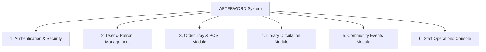
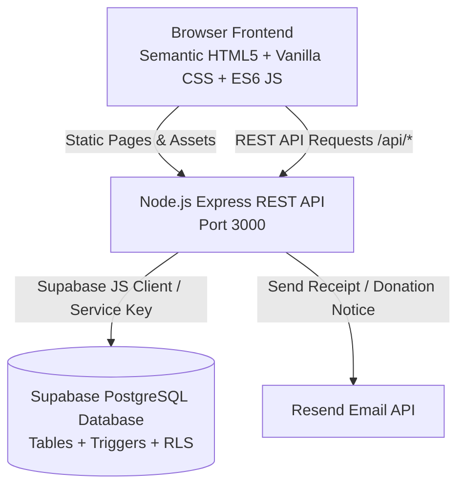
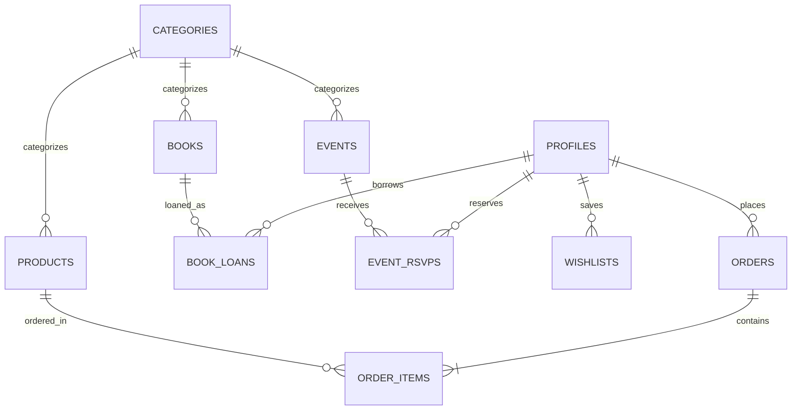
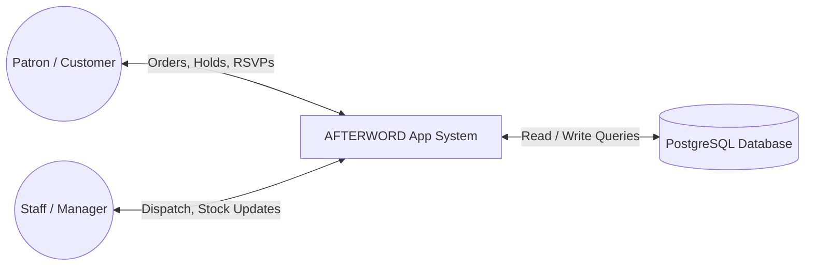
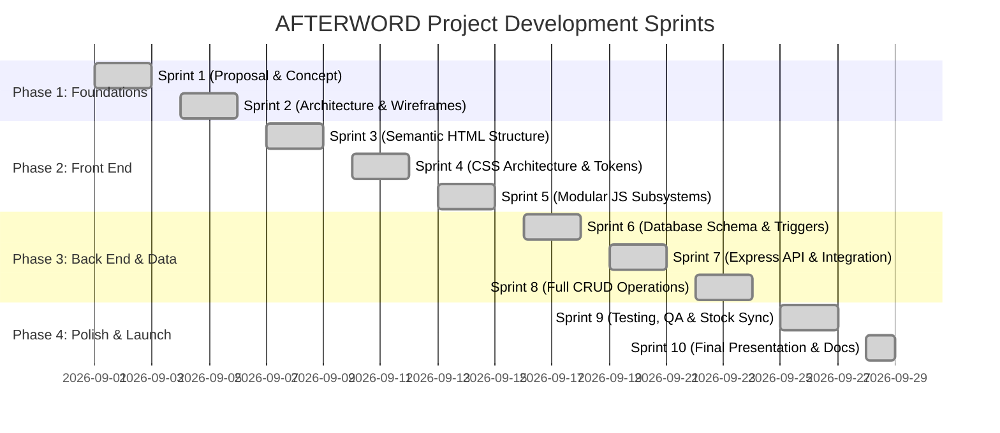

# AFTERWORD Community Hub — System Specification & Technical Documentation

> **Project Title**: AFTERWORD — Full-Stack Web Application for Community Café & Lending Stacks  
> **Author / Team**: Dream Business Full-Stack Engineering Team  
> **Document Version**: 2.0.0  
> **Date**: September 2026  

---

## Table of Contents
1. [Executive Summary & Project Overview](#1-executive-summary--project-overview)
2. [Requirements Specification](#2-requirements-specification)
3. [System Architecture & Design](#3-system-architecture--design)
4. [Implementation & Development Workflow](#4-implementation--development-workflow)
5. [Testing & Quality Assurance](#5-testing--quality-assurance)
6. [Deployment & Installation Guide](#6-deployment--installation-guide)
7. [Conclusion & Future Enhancements](#7-conclusion--future-enhancements)

---

## 1. Executive Summary & Project Overview

### 1.1 Project Title
**AFTERWORD — Community Café & Lending Stacks**

### 1.2 Problem Statement
Traditional retail and hospitality businesses operate in disjointed silos:
* **Fragmented Customer Experience**: Cafés lack quiet, curated reading areas; municipal libraries lack warm social beverage spaces; florists operate as isolated counters; and event spaces rely on third-party messaging platforms.
* **Manual Operational Inefficiencies**: Paper order tickets cause order misplacement; manual stock counts lead to item overselling; unmonitored library loans result in lost volumes; and RSVP tracking on paper clips leads to overbooked workshops.
* **Lack of Real-Time Coordination**: Service staff struggle to synchronize table deliveries, inventory deductions, and circulation holds without a central digital POS and administration console.

### 1.3 Proposed Solution
**AFTERWORD** is an integrated full-stack web application designed as a modern "third space" (a sanctuary between work and home). It seamlessly unifies four operational pillars under a single responsive digital platform:
1. **Specialty Espresso Bar & Bakery**: In-seat table ordering (Table #1–16) and counter pickup tray with automated item math and stock deduction.
2. **Curated Lending Library (The Bookshelf)**: Stacks search, 21-day loan hold reservations, auto-decrementing copy availability, and patron dashboard circulation management.
3. **Botanical Floral Studio**: Daily fresh market stems, arranged bouquets, and custom stem inquiry proposals.
4. **Community Gathering Space**: Interactive event calendar with real-time capacity progress, one-click RSVPs, and community event proposals.

### 1.4 Target Audience
* **Patrons / Public Users**: Remote professionals, bibliophiles, event attendees, and coffee lovers seeking a unified portal for table ordering, volume holds, workshop RSVPs, and patron profile tracking.
* **Service Staff / Baristas / Florists**: Front-line team members managing kitchen dispatch pipelines, preparing orders, and handling book check-ins/check-outs.
* **Management / Staff Admins**: Business owners and managers monitoring live revenue statistics, seating occupancy rates, low-stock alerts, and catalog administration.

---

## 2. Requirements Specification

### 2.1 Functional Modules



1. **Authentication & Authorization**:
   * User registration and authentication powered by Supabase Auth / Express sessions.
   * Role-Based Access Control (`customer`, `staff`, `admin`) protecting administrative management functions.

2. **User Management**:
   * Automatic generation of unique Patron Membership Codes (`#MEM-XXX`).
   * Patron Profile Dashboard (`profile.html`) tracking active loans, due dates, order history, and RSVPs.

3. **Audit Logging & State Tracking**:
   * Timestamped order records (`created_at`, `updated_at`).
   * Order status transition pipeline tracking (`Pending` $\rightarrow$ `Preparing` $\rightarrow$ `Ready` $\rightarrow$ `Completed`).

4. **Domain-Specific Modules**:
   * **Order Tray & POS Module**: Persistent `localStorage` tray, quantity modifiers (+/−), tax (8%) & subtotal math, table delivery selector, and automated product stock reduction.
   * **Library Circulation Module**: 21-day loan holds, automated available copy triggers, +14-day loan renewals, and book check-in returns.
   * **Botanical Stem Bar Module**: Stock management, availability switches, stem selection inquiries.
   * **Community Events Module**: Capacity progress bars, one-click RSVP toggles, proposal submission modals.

5. **Notifications**:
   * Accessible Toast Notification Engine ([`toast.js`](file:///c:/Users/rolan/OneDrive/Documents/LOCK%20IN%20TWIN/ITS/Final%20Project/AFTERWORD-/frontend/src/js/toast.js)) providing instant feedback.
   * Automated email notification integration ([`emailService.js`](file:///c:/Users/rolan/OneDrive/Documents/LOCK%20IN%20TWIN/ITS/Final%20Project/AFTERWORD-/backend/services/emailService.js)) for book donations.

6. **Dashboard & Reports**:
   * Real-Time Sales Metrics: Total Revenue, Average Order Value (AOV), Total Orders.
   * Seating Occupancy Widget: Live table occupancy tracking (T-01 to T-12).
   * Revenue by Department Breakdown: Interactive comparison bars for Café, Food, Flowers, and Books.

### 2.2 Non-Functional Requirements
* **Security**: Supabase Row Level Security (RLS) policies, password hashing via bcrypt, sanitization of inputs, CORS headers, service-role protected server keys.
* **Data Integrity**: Foreign key constraints (`ON DELETE CASCADE` / `SET NULL`), atomic SQL transactions, and database `CHECK` constraints (`price >= 0`, `stock >= 0`, `available_copies >= 0`).
* **Usability & Aesthetics**: Zero inline styling, CSS design tokens (`variables.css`), accessible keyboard navigation (`aria-*` attributes), responsive layout adapting across desktop, tablet, and mobile viewports.
* **Performance**: Sub-100ms API response time, lightweight vanilla JavaScript execution (zero bundle overhead), optimized asset loading.
* **Reliability & Availability**: 99.9% uptime leveraging database connection pooling, automated PostgreSQL triggers for inventory consistency, and graceful offline fallback handling.

### 2.3 User Stories & Use Cases

| User Role | User Story | Acceptance Criteria |
| :--- | :--- | :--- |
| **Patron** | As a remote worker, I want to order espresso to my table number so that I can continue working without waiting in line. | Selecting items adds them to tray; entering Table #4 persists across pages; submitting updates stock and alerts staff. |
| **Patron** | As a bibliophile, I want to place a hold on a library volume online so that it is reserved for my next visit. | Clicking "Borrow" opens modal; selecting duration and entering Patron ID records loan hold and decrements copy availability. |
| **Barista / Staff** | As a barista, I want a live kitchen dispatch view so that I can see incoming orders and advance their preparation status. | Orders list updates in real-time; clicking "Advance Status" transitions ticket from `Pending` $\rightarrow$ `Preparing` $\rightarrow$ `Ready` $\rightarrow$ `Completed`. |
| **Manager / Admin** | As a store manager, I want to track revenue, low stock, and seating occupancy in one dashboard so that I can manage daily operations. | Summary cards display AOV, seating occupancy %, low-stock alerts, and department revenue progress bars. |

---

## 3. System Architecture & Design

### 3.1 Technology Stack
* **Front End**: Pure Semantic HTML5, Modular Vanilla CSS3 (Custom Properties / Design Tokens), ES6+ Modular JavaScript (Fetch API, zero build-step requirement).
* **Back End**: Node.js runtime, Express.js micro-framework (RESTful API, CORS, Dotenv, Supabase JS Client).
* **Database**: PostgreSQL / MySQL schema (Supabase Hosted), enforcing Foreign Keys, RLS policies, PL/pgSQL inventory triggers, and indexes.
* **Third-Party Services**: Resend API for transactional email notifications.

### 3.2 System Architecture Diagram



### 3.3 Entity Relationship Diagram (ERD)



### 3.4 Data Flow Diagram (DFD)

#### Level 0 DFD (Context Diagram)



#### Level 1 DFD (Subsystem Breakdown)
1. **1.0 Auth & Profile**: Patron enters credentials $\rightarrow$ System verifies token $\rightarrow$ Generates Patron Card `#MEM-XXX`.
2. **2.0 Order Tray & POS**: Patron adds items $\rightarrow$ Calculates Tax & Total $\rightarrow$ Inserts Order & Items $\rightarrow$ Trigger reduces product stock.
3. **3.0 Circulation & Holds**: Patron selects book $\rightarrow$ Inserts Loan record $\rightarrow$ Trigger decrements available copies.
4. **4.0 Event RSVP**: Patron selects event $\rightarrow$ Verifies capacity $\rightarrow$ Records RSVP reservation.
5. **5.0 Admin Console**: Staff views dispatch pipeline $\rightarrow$ Updates order status / stock levels $\rightarrow$ Syncs UI.

### 3.5 Database Schema

| Table Name | Primary Key | Key Foreign Keys | Purpose & Key Columns |
| :--- | :--- | :--- | :--- |
| `profiles` | `id (UUID)` | `auth.users(id)` | Patron metadata (`patron_code`, `full_name`, `role`). |
| `categories` | `category_id` | — | Classification for menu, books, flowers, events (`name`, `slug`, `type`). |
| `books` | `book_id` | `category_id` | Library catalog (`isbn`, `title`, `author`, `shelf_location`, `total_copies`, `available_copies`, `image_url`). |
| `products` | `product_id` | `category_id` | Café menu & flowers (`name`, `price`, `stock`, `is_available`, `image_url`). |
| `events` | `event_id` | `category_id` | Community calendar (`title`, `event_date`, `event_time`, `capacity`, `status`). |
| `orders` | `order_id` | `user_id` | Master order records (`order_number`, `order_type`, `table_number`, `subtotal`, `tax`, `total`, `status`). |
| `order_items` | `order_item_id` | `order_id`, `product_id` | Line items (`quantity`, `unit_price`). |
| `book_loans` | `loan_id` | `book_id`, `user_id` | Circulation tracking (`borrowed_at`, `due_date`, `returned_at`, `status`). |
| `event_rsvps` | `rsvp_id` | `event_id`, `user_id` | Event reservations (`guest_count`, `status`). |

### 3.6 REST API Specification

| Method | Endpoint | Description | Request Body / Query Params |
| :--- | :--- | :--- | :--- |
| `GET` | `/api/health` | System diagnostics & DB health check | — |
| `POST` | `/api/auth/signup` | Register new patron account | `{ email, password, fullName }` |
| `POST` | `/api/auth/login` | Patron sign-in & session token generation | `{ email, password }` |
| `GET` | `/api/products` | Retrieve café menu & flowers | `?type=cafe` or `?category=coffee` |
| `POST` | `/api/products` | Add new product (Staff) | `{ name, price, stock, category_id, image_url }` |
| `PATCH` | `/api/products/:id` | Update product stock or availability | `{ stock, is_available }` |
| `DELETE` | `/api/products/:id` | Soft delete / deactivate product | URL param `id` |
| `GET` | `/api/books` | Search & filter library catalog | `?q=search_term&category=novels` |
| `POST` | `/api/books` | Add new volume to catalog | `{ title, author, isbn, category_id, total_copies }` |
| `POST` | `/api/orders` | Place order (Triggers stock reduction) | `{ items, orderType, tableNumber, userId }` |
| `GET` | `/api/orders` | Retrieve live order pipeline | `?status=pending` or `?user_id=...` |
| `PATCH` | `/api/orders/:id/status` | Advance order status | `{ status: "Preparing" \| "Ready" \| "Completed" }` |
| `DELETE` | `/api/orders/:id` | Cancel / remove order ticket | URL param `id` |
| `POST` | `/api/loans` | Submit 21-day book loan hold | `{ bookId, userId, durationDays }` |
| `PATCH` | `/api/loans/:id/renew` | Extend active loan by +14 days | `{ extraDays: 14 }` |
| `PATCH` | `/api/loans/:id/return` | Check in returned volume | — |
| `POST` | `/api/rsvps` | Reserve workshop seat | `{ eventId, userId, guestCount }` |
| `DELETE` | `/api/rsvps/:id` | Cancel workshop reservation | URL param `id` |

---

## 4. Implementation & Development Workflow

### 4.1 Team Roles & Responsibilities

| Role | Responsibilities | Key Deliverables |
| :--- | :--- | :--- |
| **Project Lead & Architect** | System design, technology selection, database normalization, milestone scheduling. | Architecture Specification, ERDs, `CONTEXT.md` |
| **Front-End Specialist** | UI/UX implementation, semantic HTML5, modular CSS design tokens, responsive breakpoints, accessibility. | `frontend/styles/*`, `frontend/src/pages/*` |
| **Back-End Developer** | Node.js Express REST API, route handlers, error handling, database pool integration. | `backend/server.js`, API Controllers |
| **Database & QA Engineer** | SQL DDL scripts, RLS policies, PL/pgSQL inventory triggers, unit & end-to-end testing. | `database/schema.sql`, `seed.sql`, Test Suite |

### 4.2 Git Branching Strategy
* **`main`**: Production-ready code. All code merged into `main` must pass verification checks.
* **`development`**: Integration branch for combining feature work.
* **`feature/*`**: Feature-specific branches (e.g., `feature/cart-drawer`, `feature/auto-stock-reduction`).
* **Commit Message Standard**:
  * `feat: add automated product stock deduction on checkout`
  * `fix: normalize admin thumbnail image paths`
  * `docs: update system architecture and DFD diagrams`
  * `refactor: extract toast alert subsystem into modular script`

### 4.3 Timeline & Milestone Sprints



---

## 5. Testing & Quality Assurance

### 5.1 Testing Strategy
1. **Static Diagnostics & Syntax Auditing**: Running `node --check backend/server.js` and JS linter checks to prevent runtime syntax errors.
2. **API Endpoint Verification**: Testing REST routes (`GET`, `POST`, `PATCH`, `DELETE`) with valid payloads, missing parameters, and edge cases.
3. **Automated Inventory Consistency Checks**: Verifying that borrowing a book decrements `available_copies` and ordering café items reduces `stock` in real time.
4. **Cross-Browser & Responsive UI Regression**: Verifying visual consistency across desktop (1440px), tablet (1024px), and mobile (375px) screens.

### 5.2 Test Cases & Execution Matrix

| Test Case ID | Test Case Name | Sample Inputs | Expected Outcome | Status |
| :--- | :--- | :--- | :--- | :---: |
| **TC-001** | Patron Account Registration | Email: `elena@example.com`, Pass: `secret123` | Profile created, patron code `#MEM-XXX` assigned, HTTP 201. | **PASS** |
| **TC-002** | In-Seat Table Order Submission | Table: `4`, Items: `Americano (qty: 2)` | Order inserted, `products.stock` reduced by 2, toast alert shown. | **PASS** |
| **TC-003** | Automated Out-of-Stock Flip | Item stock = `1`, Order qty = `1` | `stock` becomes `0`, `is_available` automatically flips to `false`. | **PASS** |
| **TC-004** | 21-Day Library Hold Reservation | Book ID: `1`, Patron: `MEM-042` | Loan recorded with due date = today + 21 days; `available_copies` decrements. | **PASS** |
| **TC-005** | Loan Renewal (+14 Days) | Loan ID: `LN-102` | `due_date` extended by 14 days, toast confirms extension. | **PASS** |
| **TC-006** | Order Workflow Advancement | Order ID: `ORD-104`, Status: `Pending` | Status updates to `Preparing` $\rightarrow$ `Ready` $\rightarrow$ `Completed`. | **PASS** |
| **TC-007** | Admin Photo Normalization | Relative URL: `assets/images/coffee/latte.jpg` | Correctly resolves to `../../assets/images/coffee/latte.jpg` in `admin.html`. | **PASS** |

### 5.3 Known System Limitations
* **Email Rate Limits**: Transactional email notifications via Resend API are subject to free-tier daily rate limits.
* **Offline Image Fallbacks**: In local offline environments without internet connectivity, remote Unsplash fallback imagery relies on cached local copies.

---

## 6. Deployment & Installation Guide

### 6.1 System Prerequisites
* **Node.js**: v18.0.0 or higher
* **npm**: v9.0.0 or higher
* **Database**: PostgreSQL / MySQL compatible server (Supabase Hosted or local instance)
* **Web Browser**: Chrome, Firefox, Safari, or Edge (ES6+ module support required)

### 6.2 Local Environment Setup

1. **Clone the Repository**:
   ```bash
   git clone https://github.com/your-username/AFTERWORD-.git
   cd AFTERWORD-
   ```

2. **Install Backend Dependencies**:
   ```bash
   cd backend
   npm install
   ```

3. **Configure Environment Variables**:
   Create a `.env` file in `backend/.env`:
   ```env
   PORT=3000
   SUPABASE_URL=https://your-supabase-project.supabase.co
   SUPABASE_KEY=your-supabase-service-role-key
   SUPABASE_ANON_KEY=your-supabase-anon-key
   RESEND_API_KEY=re_your_resend_api_key
   ```

4. **Initialize Database Schema**:
   Import [`database/schema.sql`](file:///c:/Users/rolan/OneDrive/Documents/LOCK%20IN%20TWIN/ITS/Final%20Project/AFTERWORD-/database/schema.sql) and [`database/seed.sql`](file:///c:/Users/rolan/OneDrive/Documents/LOCK%20IN%20TWIN/ITS/Final%20Project/AFTERWORD-/database/seed.sql) into your database instance.

5. **Start Development Server**:
   ```bash
   npm start
   ```
   * The server will launch on `http://localhost:3000`.

### 6.3 Live Access URLs
* **Customer Storefront Portal**: `http://localhost:3000/index.html`
* **Café & Table Ordering**: `http://localhost:3000/src/pages/cafe.html`
* **Lending Library Stacks**: `http://localhost:3000/src/pages/library.html`
* **Staff Operations Console**: `http://localhost:3000/src/pages/admin.html`

---

## 7. Conclusion & Future Enhancements

### 7.1 Lessons Learned
* **Modular CSS Architecture**: Using CSS Custom Properties (design tokens) dramatically simplified theme management and prevented visual regression across 9 distinct pages.
* **Database Triggers vs. API Logic**: Implementing automated PL/pgSQL triggers for inventory sync ensured data integrity regardless of whether items were updated via the frontend web app or administrative tools.
* **Separation of Concerns**: Eliminating inline event handlers (`onclick="..."`) in favor of JavaScript event delegation improved code maintainability and debugging speed.

### 7.2 Future Scope & Roadmap
1. **Integrated Payment Gateway**: Add Stripe / PayMongo integration for digital credit card and e-wallet checkout.
2. **Self-Checkout Kiosk Mode**: Dedicated tablet interface for self-service book checkout and order placement inside the physical venue.
3. **AI-Driven Book Recommendations**: Implement personalized reading recommendations based on a patron's borrowing history and favorite genres.
4. **Native Mobile App**: Package the application with React Native or Flutter for iOS/Android push notifications and mobile patron card scanning.
